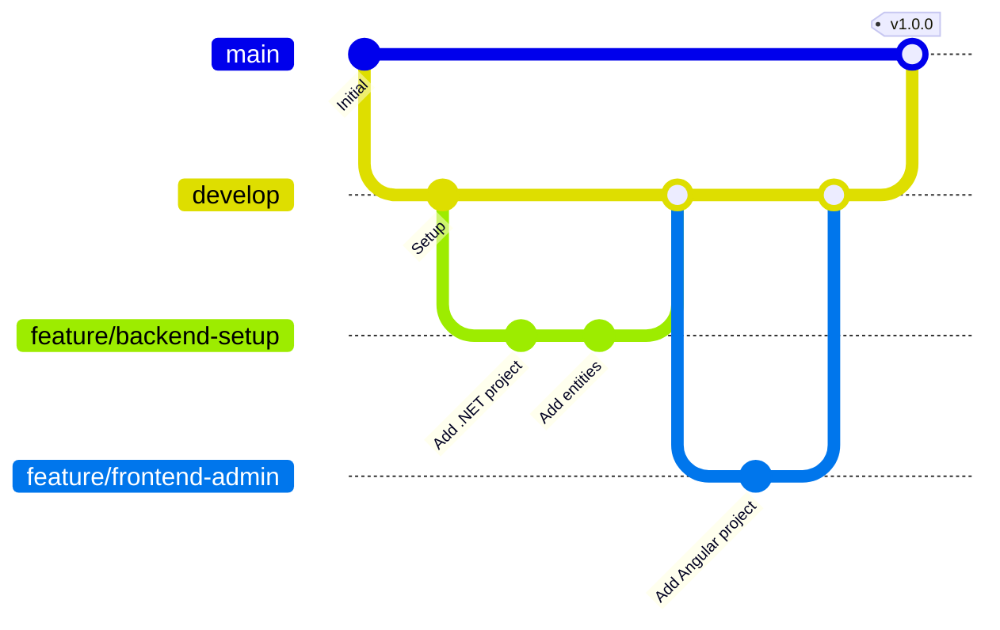

# Estrategia de Ramas - Git Flow

## Ramas Principales

| Rama      | Propósito               | Protección              |
| :-------- | :---------------------- | :---------------------- |
| `main`    | Producción estable      | ✅ Requiere PR + Review |
| `develop` | Integración de features | ✅ Requiere PR          |

## Ramas de Trabajo

| Prefijo     | Uso                           | Ejemplo                       |
| :---------- | :---------------------------- | :---------------------------- |
| `feature/*` | Nuevas funcionalidades        | `feature/backend-setup`       |
| `bugfix/*`  | Correcciones en develop       | `bugfix/fix-login-validation` |
| `hotfix/*`  | Correcciones urgentes en prod | `hotfix/fix-critical-crash`   |
| `release/*` | Preparación de release        | `release/v1.0.0`              |

## Feature Branches Actuales

```
feature/backend-setup        → Configuración inicial .NET 8 + Clean Architecture
feature/frontend-admin       → Proyecto Angular 18 + Material
feature/frontend-operaciones → React PWA para Almacenistas (Tablet)
feature/frontend-campo       → React PWA para Choferes (Mobile)
```

## Flujo de Trabajo



## Reglas

1. **Nunca** hacer push directo a `main`
2. **Siempre** crear PR de `feature/*` → `develop`
3. **Solo** hacer merge a `main` desde `develop` via Release
4. Los **commits** deben seguir Conventional Commits:
   - `feat:` Nueva funcionalidad
   - `fix:` Corrección de bug
   - `docs:` Documentación
   - `refactor:` Refactorización sin cambio funcional
   - `test:` Agregar/modificar tests
   - `chore:` Tareas de mantenimiento

## Comandos Útiles

```bash
# Crear nueva feature
git checkout develop
git pull origin develop
git checkout -b feature/nombre-feature

# Terminar feature (crear PR en GitHub)
git push -u origin feature/nombre-feature
# → Crear Pull Request en GitHub: feature/* → develop

# Sincronizar develop local
git checkout develop
git pull origin develop
```
