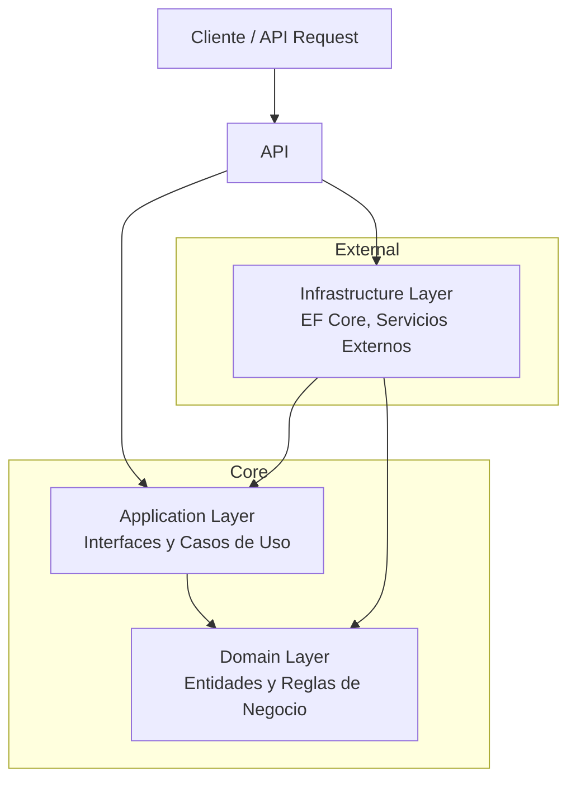
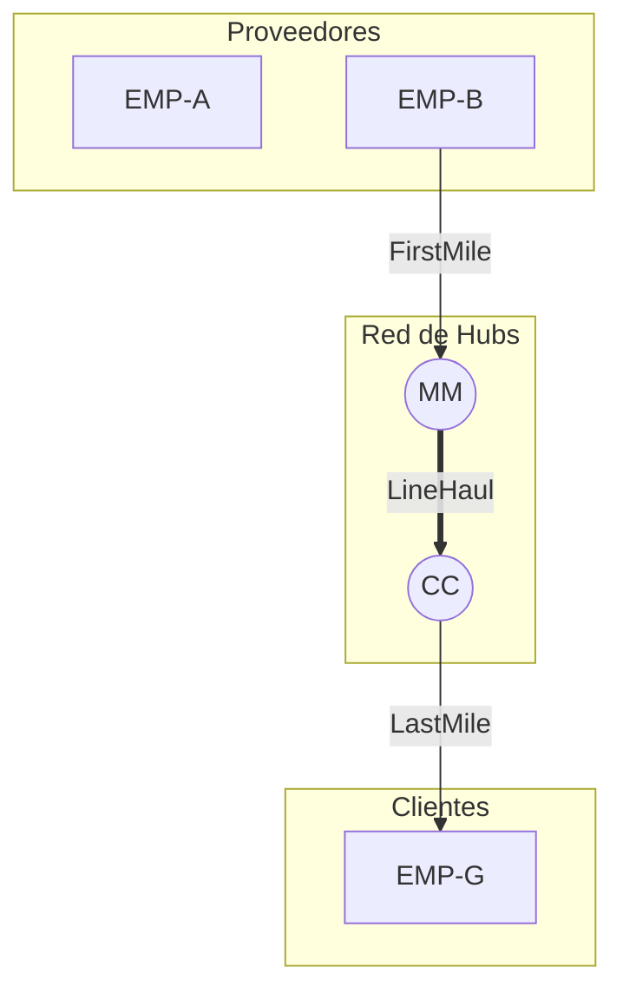

# Parhelion Logistics


Plataforma Unificada de Logística B2B (WMS + TMS) nivel Enterprise. Gestiona inventarios, flotas tipificadas, redes Hub & Spoke y documentación legal (Carta Porte) en un entorno Multi-tenant.

> **Estado:** Development Preview v0.4.3 - Employee Layer Implementado

---

## Descripción

**Parhelion-Logistics** es una plataforma SaaS multi-tenant de nivel Enterprise que unifica las capacidades de un WMS (Warehouse Management System) y un TMS (Transportation Management System). Diseñada para empresas de transporte B2B que requieren gestión integral: inventarios estáticos en almacén, flotas tipificadas (refrigerado, HAZMAT, blindado), redes de distribución Hub & Spoke, trazabilidad por checkpoints y documentación legal mexicana (Carta Porte, POD).

**Objetivo Técnico:** Implementación de **Clean Architecture** y **Domain-Driven Design (DDD)** en un entorno de producción utilizando .NET 8, Angular, React, Docker y PostgreSQL.

---

## Características (MVP Final)

### Core

- [x] Documentación de requerimientos y esquema de base de datos
- [x] **Arquitectura Base:** Configuración de Clean Architecture y estructura de proyecto
- [x] **Multi-tenancy:** Query Filters globales por TenantId
- [x] **Domain Layer:** 14 entidades + 11 enumeraciones
- [x] **Infrastructure Layer:** EF Core + PostgreSQL + Migrations

### Gestión de Flotilla

- [ ] **Camiones Tipificados:** DryBox, Refrigerado, HAZMAT, Plataforma, Blindado
- [ ] **Choferes:** Asignación fija (default_truck) y dinámica (current_truck)
- [ ] **Bitácora de Flotilla:** Historial de cambios de vehículo (FleetLog)

### Red Logística (Hub & Spoke)

- [ ] **Nodos de Red:** RegionalHub, CrossDock, Warehouse, Store, SupplierPlant
- [ ] **Códigos Aeroportuarios:** Identificadores únicos por ubicación (MTY, GDL, MM)
- [ ] **Enlaces de Red:** Conexiones FirstMile, LineHaul, LastMile
- [ ] **Rutas Predefinidas:** RouteBlueprint con paradas y tiempos de tránsito

### Envíos y Trazabilidad

- [ ] **Manifiesto de Carga:** Items con peso volumétrico y valor declarado
- [ ] **Restricciones de Compatibilidad:** Cadena de frío, HAZMAT, Alto valor
- [ ] **Checkpoints:** Bitácora de eventos (Loaded, QrScanned, ArrivedHub, Delivered)
- [ ] **QR Handshake:** Transferencia de custodia digital mediante escaneo

### Documentación B2B

- [ ] **Orden de Servicio:** Petición inicial del cliente
- [ ] **Carta Porte (Waybill):** Documento legal SAT para transporte
- [ ] **Manifiesto de Carga:** Checklist de estiba para almacenista
- [ ] **Hoja de Ruta:** Itinerario con ventanas de entrega
- [ ] **POD (Proof of Delivery):** Firma digital del receptor

### Operación

- [ ] **Seguridad:** Autenticación JWT con roles (Admin/Chofer/Almacenista)
- [ ] **Dashboard:** KPIs operativos en tiempo real
- [ ] **Modo Demo:** Acceso para reclutadores sin registro previo

---

## Stack Tecnológico

| Capa                     | Tecnología                            | Usuario     |
| :----------------------- | :------------------------------------ | :---------- |
| **Backend**              | C# / .NET 8 Web API                   | -           |
| **Base de Datos**        | PostgreSQL 16                         | -           |
| **ORM**                  | Entity Framework Core (Code First)    | -           |
| **Frontend (Admin)**     | Angular 18+ (Material Design)         | Admin       |
| **Frontend (Operacion)** | React + Vite + Tailwind CSS (PWA)     | Almacenista |
| **Frontend (Campo)**     | React + Vite + Tailwind CSS (PWA)     | Chofer      |
| **Infraestructura**      | Docker Compose, Nginx (Reverse Proxy) | -           |
| **Hosting**              | Digital Ocean Droplet (Linux)         | -           |

---

## Design System

El proyecto utiliza un estilo visual **Neo-Brutalism** con la paleta de colores "Industrial Solar":

| Token   | Color     | Uso                             |
| :------ | :-------- | :------------------------------ |
| `oxide` | `#C85A17` | Acciones, acentos, hover states |
| `sand`  | `#E8E6E1` | Fondos secundarios              |
| `black` | `#000000` | Bordes, texto, sombras          |
| `white` | `#FAFAFA` | Fondos principales              |

### Tipografía

- **Logo:** New Rocker (display font)
- **Títulos:** Merriweather (serif)
- **Body:** Inter (sans-serif)

### Componentes

Los frontends incluyen componentes pre-estilizados: `btn`, `btn-primary`, `btn-oxide`, `card`, `input` con sombras brutalist y transiciones sólidas (sin gradientes).

> UI inspirada en [neobrutalism-components](https://github.com/ekmas/neobrutalism-components)

---

## Arquitectura

El proyecto sigue estrictamente **Clean Architecture** para desacoplar la lógica de negocio de la infraestructura:



### Topología de Red (Hub & Spoke)



---

## Base de Datos

### Tecnologías

| Componente | Tecnología                            | Versión     |
| ---------- | ------------------------------------- | ----------- |
| ORM        | Entity Framework Core                 | 8.0.10      |
| Provider   | Npgsql.EntityFrameworkCore.PostgreSQL | 8.0.10      |
| Database   | PostgreSQL                            | 17 (Docker) |
| Migrations | Code First                            | ✅          |

### Características de Seguridad

- **Anti SQL Injection:** Queries parameterizadas automáticas de EF Core
- **Multi-Tenancy:** Query Filters globales por TenantId
- **Soft Delete:** Todas las entidades soportan borrado lógico
- **Audit Trail:** CreatedAt, UpdatedAt, DeletedAt automáticos
- **Password Hashing:** BCrypt (usuarios) + Argon2id (admins)

### Naming Convention

```
PascalCase en C# → PascalCase en PostgreSQL
Ejemplo: ShipmentItem.TenantId → "ShipmentItems"."TenantId"
```

Para más detalles técnicos, ver [Sección 12 de database-schema.md](./database-schema.md#12-metodología-de-implementación-detalles-técnicos)

---

## Estructura del Proyecto

```
src/
├── Parhelion.Domain/         # Núcleo: Entidades y Excepciones (Sin dependencias)
├── Parhelion.Application/    # Reglas: DTOs, Interfaces, Validaciones
├── Parhelion.Infrastructure/ # Persistencia: DbContext, Repositorios, Migraciones
└── Parhelion.API/            # Entrada: Controllers, JWT Config, DI
```

---

## Documentación

| Documento                                        | Descripción                                   |
| :----------------------------------------------- | :-------------------------------------------- |
| [Requerimientos (MVP)](./requirments.md)         | Especificación funcional completa del sistema |
| [Esquema de Base de Datos](./database-schema.md) | Diagrama ER, entidades y reglas de negocio    |

---

## Entidades Principales

| Entidad              | Descripción                                    |
| :------------------- | :--------------------------------------------- |
| `Tenant`             | Cliente/Empresa (Multi-tenancy)                |
| `Location`           | Nodo de red con código único (Hub, Store, etc) |
| `Truck`              | Vehículo tipificado con capacidad              |
| `Driver`             | Chofer con camión fijo y actual                |
| `Shipment`           | Envío con ruta asignada y documentos           |
| `ShipmentItem`       | Partida del manifiesto con peso volumétrico    |
| `ShipmentCheckpoint` | Evento de trazabilidad                         |
| `RouteBlueprint`     | Ruta predefinida con paradas                   |
| `NetworkLink`        | Conexión entre nodos (adyacencia)              |

---

## Despliegue

| Servicio        | URL                   |
| :-------------- | :-------------------- |
| **API Backend** | `api.macrostasis.lat` |
| **Frontend**    | `macrostasis.lat`     |

---

## Autor

**MetaCodeX** | 2025

_Proyecto desarrollado como portafolio profesional de Arquitectura de Software y Sistemas Logísticos B2B._
