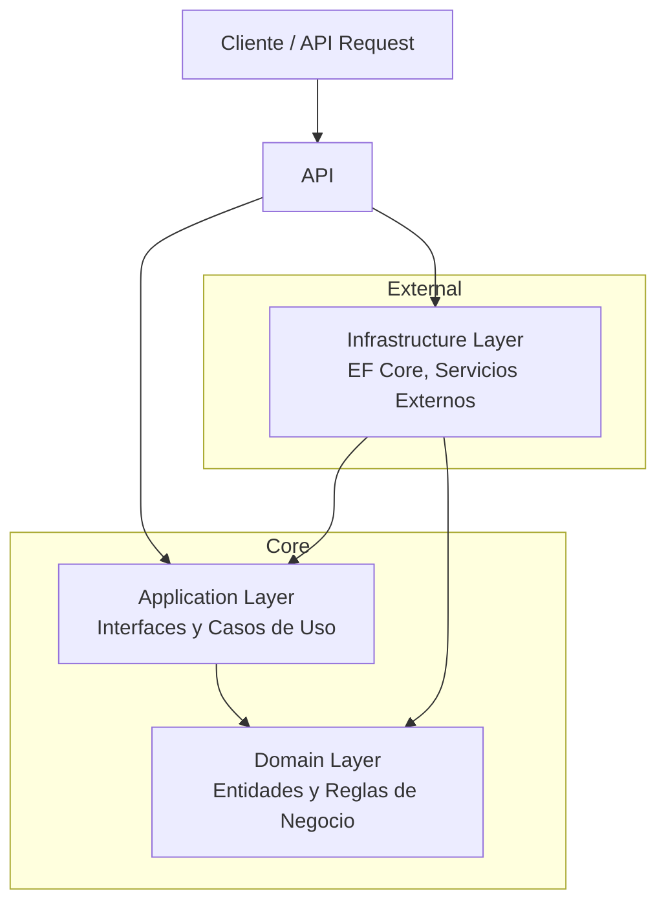
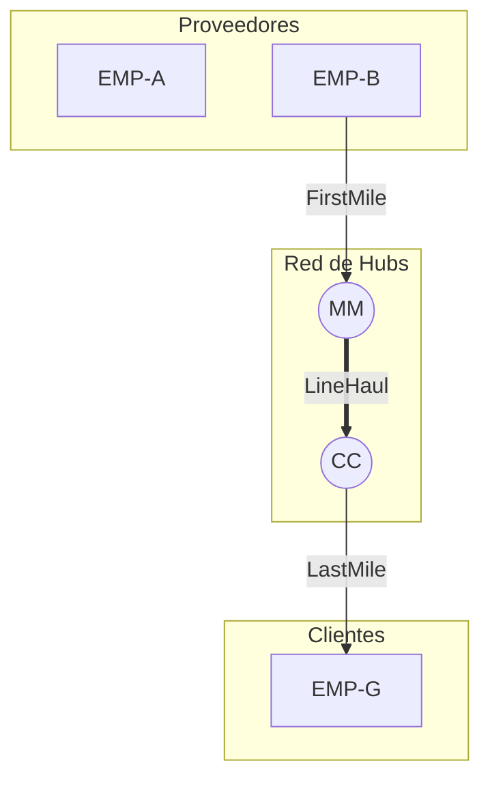
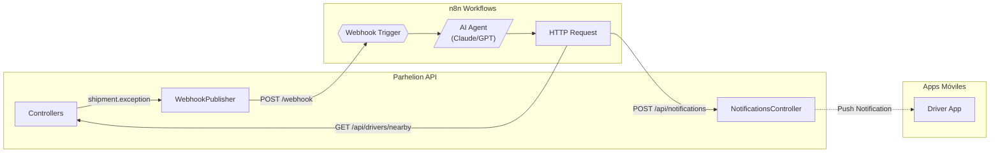

# Parhelion Logistics


Plataforma Unificada de Logística B2B (WMS + TMS) nivel Enterprise. Gestiona inventarios, flotas tipificadas, redes Hub & Spoke y documentación legal (Carta Porte) en un entorno Multi-tenant con **agentes de IA automatizados** y **análisis predictivo con Python**.

> **Estado:** Development Preview v0.6.0-alpha - Python Microservice Integration

---

## Descripción

**Parhelion-Logistics** es una plataforma SaaS multi-tenant de nivel Enterprise que unifica las capacidades de un WMS (Warehouse Management System) y un TMS (Transportation Management System). Diseñada para empresas de transporte B2B que requieren gestión integral: inventarios estáticos en almacén, flotas tipificadas (refrigerado, HAZMAT, blindado), redes de distribución Hub & Spoke, trazabilidad por checkpoints y documentación legal mexicana (Carta Porte, POD).

**Objetivo Técnico:** Implementación de **Clean Architecture** y **Domain-Driven Design (DDD)** en un entorno de producción utilizando .NET 8, **Python (FastAPI)**, Angular, React, Docker, PostgreSQL y **n8n** para automatización inteligente.

---

## Características (MVP Final)

### Core

- [x] Documentacion de requerimientos y esquema de base de datos
- [x] **[NUEVO]** [Guía de Webhooks y Automatización](./service-webhooks.md)
- [x] **Arquitectura Base:** Configuracion de Clean Architecture y estructura de proyecto
- [x] **Multi-tenancy:** Query Filters globales por TenantId
- [x] **Domain Layer:** 25 entidades + 17 enumeraciones
- [x] **Infrastructure Layer:** EF Core + PostgreSQL + Migrations
- [x] **API Skeleton:** 22 endpoints base para todas las entidades
- [x] **Autenticacion:** JWT con roles SuperAdmin/Admin/Driver/Warehouse
- [x] **Repository Pattern:** GenericRepository + UnitOfWork + Soft Delete
- [x] **xUnit Tests:** 122 tests (foundation + services + business rules)
- [x] **Services Layer:** 22 servicios (Core, Shipment, Fleet, Network, Warehouse)

### Gestion de Flotilla

- [x] **Camiones Tipificados:** DryBox, Refrigerado, HAZMAT, Plataforma, Blindado
- [x] **Choferes:** Asignacion fija (default_truck) y dinamica (current_truck)
- [x] **Bitacora de Flotilla:** Historial de cambios de vehiculo (FleetLog automático)
- [x] **Telemetría GPS:** Campos LastLatitude/LastLongitude en Trucks
- [x] **Búsqueda Geoespacial:** Endpoint `/api/drivers/nearby` (Haversine)

### Automatización e Inteligencia (n8n)

- [x] **Webhooks (Backend → n8n):** 5 tipos de eventos (ShipmentException, BookingRequest, HandshakeAttempt, StatusChanged, CheckpointCreated)
- [x] **Notificaciones (n8n → Backend):** Push notifications persistidas para apps móviles
- [x] **ServiceApiKey Multi-Tenant:** Autenticación de agentes IA por tenant con SHA256
- [x] **Generación Automática:** API Key creada junto con cada nuevo Tenant
- [x] **Agente Crisis Management:** Búsqueda de chofer cercano ante excepciones

### Red Logistica (Hub and Spoke)

- [x] **Nodos de Red:** RegionalHub, CrossDock, Warehouse, Store, SupplierPlant
- [x] **Codigos Aeroportuarios:** Identificadores unicos por ubicacion (MTY, GDL, MM)
- [x] **Enlaces de Red:** Conexiones FirstMile, LineHaul, LastMile
- [x] **Rutas Predefinidas:** RouteBlueprint con paradas y tiempos de transito

### Envios y Trazabilidad

- [x] **Manifiesto de Carga:** Items con peso volumetrico y valor declarado
- [x] **Restricciones de Compatibilidad:** Cadena de frio, HAZMAT, Alto valor (validador automatico)
- [x] **Checkpoints:** Bitacora de eventos (Loaded, QrScanned, ArrivedHub, Delivered)
- [x] **Timeline Metro:** Endpoint `/api/shipment-checkpoints/timeline/{id}` con labels en español
- [ ] **QR Handshake:** Transferencia de custodia digital mediante escaneo

### Documentacion B2B (Generación Dinámica)

- [x] **Orden de Servicio:** `GET /api/documents/service-order/{id}`
- [x] **Carta Porte (Waybill):** `GET /api/documents/waybill/{id}`
- [x] **Manifiesto de Carga:** `GET /api/documents/manifest/{id}`
- [x] **Hoja de Ruta:** `GET /api/documents/trip-sheet/{id}`
- [x] **POD (Proof of Delivery):** `GET /api/documents/pod/{id}` con firma digital

> Los PDFs se generan on-demand con datos de BD. Cliente crea `blob:` URL local (sin almacenamiento).

### Operacion

- [x] **Seguridad:** Autenticacion JWT con roles (Admin/Chofer/Almacenista)
- [ ] **Dashboard:** KPIs operativos en tiempo real
- [ ] **Modo Demo:** Acceso para reclutadores sin registro previo

---

## Demo (Development Preview)

| Aplicación       | URL Pública                                                    | Descripción                                 |
| :--------------- | :------------------------------------------------------------- | :------------------------------------------ |
| **Landing Page** | [parhelion.macrostasis.lat](https://parhelion.macrostasis.lat) | Página principal con changelog y navegación |
| **Panel Admin**  | [phadmin.macrostasis.lat](https://phadmin.macrostasis.lat)     | Gestión administrativa (Angular)            |
| **Operaciones**  | [phops.macrostasis.lat](https://phops.macrostasis.lat)         | App para almacenistas (React PWA)           |
| **Driver App**   | [phdriver.macrostasis.lat](https://phdriver.macrostasis.lat)   | App para choferes (React PWA)               |

> Infraestructura: Cloudflare Tunnel (Zero Trust) + Docker Compose + Digital Ocean

---

## Python Analytics Service (v0.6.0)

Microservicio dedicado para analisis avanzado, predicciones ML y reportes. Implementado con Clean Architecture en Python.

Para documentacion completa del servicio, ver [python-analytics.md](./python-analytics.md).

| Componente | Tecnologia               | Estado  |
| ---------- | ------------------------ | ------- |
| Framework  | FastAPI 0.115+           | Activo  |
| Runtime    | Python 3.12              | Activo  |
| ORM        | SQLAlchemy 2.0 + asyncpg | Activo  |
| Testing    | pytest + pytest-asyncio  | 4 tests |
| Container  | parhelion-python:8000    | Healthy |

---

## Stack Tecnológico

| Capa                     | Tecnología                            | Usuario     |
| :----------------------- | :------------------------------------ | :---------- |
| **Backend**              | C# / .NET 8 Web API                   | -           |
| **Analytics Service**    | Python 3.12 / FastAPI                 | -           |
| **Base de Datos**        | PostgreSQL 17                         | -           |
| **ORM (.NET)**           | Entity Framework Core (Code First)    | -           |
| **ORM (Python)**         | SQLAlchemy 2.0 + asyncpg              | -           |
| **Automatización**       | n8n (Workflow Automation)             | Agentes IA  |
| **Frontend (Admin)**     | Angular 18+ (Material Design)         | Admin       |
| **Frontend (Operacion)** | React + Vite + Tailwind CSS (PWA)     | Almacenista |
| **Frontend (Campo)**     | React + Vite + Tailwind CSS (PWA)     | Chofer      |
| **Infraestructura**      | Docker Compose, Nginx (Reverse Proxy) | -           |
| **Hosting**              | Digital Ocean Droplet (Linux)         | -           |

---

## Design System

El proyecto utiliza un estilo visual **Neo-Brutalism** con la paleta de colores "Industrial Solar":

| Token   | Color     | Uso                             |
| :------ | :-------- | :------------------------------ |
| `oxide` | `#C85A17` | Acciones, acentos, hover states |
| `sand`  | `#E8E6E1` | Fondos secundarios              |
| `black` | `#000000` | Bordes, texto, sombras          |
| `white` | `#FAFAFA` | Fondos principales              |

### Tipografía

- **Logo:** New Rocker (display font)
- **Títulos:** Merriweather (serif)
- **Body:** Inter (sans-serif)

### Componentes

Los frontends incluyen componentes pre-estilizados: `btn`, `btn-primary`, `btn-oxide`, `card`, `input` con sombras brutalist y transiciones sólidas (sin gradientes).

> UI inspirada en [neobrutalism-components](https://github.com/ekmas/neobrutalism-components)

---

## Arquitectura

El proyecto sigue estrictamente **Clean Architecture** para desacoplar la lógica de negocio de la infraestructura:



### Topología de Red (Hub & Spoke)



### Integración n8n (Automatización)



**Flujo de Crisis Management:**

1. Backend detecta `ShipmentStatus.Exception` → publica webhook
2. n8n recibe evento → activa Agente IA
3. Agente consulta `/api/drivers/nearby` con coordenadas del incidente
4. Agente crea notificación para chofer de rescate
5. App móvil recibe push notification

---

## Base de Datos

### Tecnologías

| Componente | Tecnología                            | Versión     |
| ---------- | ------------------------------------- | ----------- |
| ORM        | Entity Framework Core                 | 8.0.10      |
| Provider   | Npgsql.EntityFrameworkCore.PostgreSQL | 8.0.10      |
| Database   | PostgreSQL                            | 17 (Docker) |
| Migrations | Code First                            |             |

### Características de Seguridad

- **Anti SQL Injection:** Queries parameterizadas automáticas de EF Core
- **Multi-Tenancy:** Query Filters globales por TenantId
- **Soft Delete:** Todas las entidades soportan borrado lógico
- **Audit Trail:** CreatedAt, UpdatedAt, DeletedAt automáticos
- **Password Hashing:** BCrypt (usuarios) + Argon2id (admins)

### Naming Convention

```
PascalCase en C# → PascalCase en PostgreSQL
Ejemplo: ShipmentItem.TenantId → "ShipmentItems"."TenantId"
```

Para más detalles técnicos, ver [Sección 12 de database-schema.md](./database-schema.md#12-metodología-de-implementación-detalles-técnicos)

---

## Estructura del Proyecto

```
backend/src/
├── Parhelion.Domain/         # Núcleo: Entidades y Excepciones (Sin dependencias)
├── Parhelion.Application/    # Reglas: DTOs, Interfaces, Validaciones
├── Parhelion.Infrastructure/ # Persistencia: DbContext, Repositorios, Migraciones
└── Parhelion.API/            # Entrada: Controllers, JWT Config, DI

service-python/               # Microservicio Python (Analytics & Predictions)
├── src/parhelion_py/         # Clean Architecture: domain, application, infrastructure, api
│   ├── domain/               # Entidades, Value Objects, Interfaces
│   ├── application/          # DTOs, Services, Use Cases
│   ├── infrastructure/       # Database, External Clients
│   └── api/                  # FastAPI Routers, Middleware
└── tests/                    # pytest unit/integration tests
```

---

## Documentacion

| Documento                                        | Descripcion                                     |
| :----------------------------------------------- | :---------------------------------------------- |
| [Requerimientos (MVP)](./requirments.md)         | Especificacion funcional completa del sistema   |
| [Esquema de Base de Datos](./database-schema.md) | Diagrama ER, entidades y reglas de negocio      |
| [Arquitectura de API](./api-architecture.md)     | Estructura de capas y endpoints (.NET + Python) |
| [Python Analytics](./python-analytics.md)        | Roadmap, 10 objetivos, estructura del servicio  |
| [Guia de Webhooks](./service-webhooks.md)        | Integracion n8n, eventos y notificaciones       |
| [CHANGELOG](./CHANGELOG.md)                      | Historial detallado de todas las versiones      |

---

## Entidades Principales

| Entidad              | Descripción                                    |
| :------------------- | :--------------------------------------------- |
| `Tenant`             | Cliente/Empresa (Multi-tenancy)                |
| `Location`           | Nodo de red con código único (Hub, Store, etc) |
| `Truck`              | Vehículo tipificado con capacidad              |
| `Driver`             | Chofer con camión fijo y actual                |
| `Shipment`           | Envío con ruta asignada y documentos           |
| `ShipmentItem`       | Partida del manifiesto con peso volumétrico    |
| `ShipmentCheckpoint` | Evento de trazabilidad                         |
| `RouteBlueprint`     | Ruta predefinida con paradas                   |
| `NetworkLink`        | Conexión entre nodos (adyacencia)              |

---

## Despliegue

| Servicio        | URL                   |
| :-------------- | :-------------------- |
| **API Backend** | `api.macrostasis.lat` |
| **Frontend**    | `macrostasis.lat`     |

---

## Roadmap

### Completado

| Version | Fecha   | Descripcion                                                 |
| ------- | ------- | ----------------------------------------------------------- |
| v0.1.0  | 2025-12 | Estructura inicial, documentación de requerimientos         |
| v0.2.0  | 2025-12 | Domain Layer: Entidades base y enumeraciones                |
| v0.3.0  | 2025-12 | Infrastructure Layer: EF Core, PostgreSQL, Migrations       |
| v0.4.0  | 2025-12 | API Layer: Controllers base, JWT Authentication             |
| v0.5.0  | 2025-12 | Services Layer: Repository Pattern, UnitOfWork              |
| v0.5.1  | 2025-12 | Foundation Tests: DTOs, Repository, UnitOfWork              |
| v0.5.2  | 2025-12 | Services Implementation: 16 interfaces, 15 implementaciones |
| v0.5.3  | 2025-12 | Integration Tests: 72 tests para Services                   |
| v0.5.4  | 2025-12 | Swagger/OpenAPI, Business Logic Workflow                    |
| v0.5.5  | 2025-12 | WMS/TMS Services, Business Rules, 122 tests                 |
| v0.5.6  | 2025-12 | n8n Integration, Webhooks, Notifications, ServiceApiKey     |
| v0.5.7  | 2025-12 | Dynamic PDF Generation, Checkpoint Timeline, POD Signatures |

### En Progreso (v0.6.x - Python Integration)

| Version          | Nombre Clave  | Descripción                                        |
| ---------------- | ------------- | -------------------------------------------------- |
| **v0.6.0-alpha** | `foundation`  | Estructura base Python, Docker, health checks      |
| v0.6.0-beta      | `integration` | Comunicación API ↔ Python, autenticación interna   |
| v0.6.0-rc.1      | `validation`  | Tests de integración, documentación                |
| **v0.6.0**       | `Python Core` | Release estable con microservicio Python integrado |

### Proximas Versiones (v0.7.0-v1.0.0)

#### v0.7.0-v0.7.4: Operaciones de Campo (QR + Rutas)

| Version | Feature          | Descripción                                        |
| ------- | ---------------- | -------------------------------------------------- |
| v0.7.0  | QR Generation    | Generación de códigos QR por envío (Angular Admin) |
| v0.7.1  | QR Scanning      | Lectura QR en React PWA (Driver + Operaciones)     |
| v0.7.2  | Custody Transfer | Transferencia de custodia digital con checkpoint   |
| v0.7.3  | Route Assignment | Asignación de rutas predefinidas a shipments       |
| v0.7.4  | Route Progress   | Avance automático por pasos de ruta                |

#### v0.8.0-v0.8.5: Frontend Admin Panel (Angular)

| Version | Feature           | Descripción                                   |
| ------- | ----------------- | --------------------------------------------- |
| v0.8.0  | Admin Shell       | Layout, navegación, auth guards, interceptors |
| v0.8.1  | Core CRUD         | Gestión de Tenants, Users, Roles, Employees   |
| v0.8.2  | Fleet CRUD        | Gestión de Trucks, Drivers, FleetLogs         |
| v0.8.3  | Shipment CRUD     | Crear envíos, asignar chofer/camión, items    |
| v0.8.4  | Shipment Tracking | Timeline de checkpoints, status updates       |
| v0.8.5  | Network CRUD      | Gestión de Locations, Routes, NetworkLinks    |

#### v0.9.0-v0.9.6: Frontend PWAs + Dashboard

| Version | Feature              | Descripción                                    |
| ------- | -------------------- | ---------------------------------------------- |
| v0.9.0  | Operaciones PWA      | App tablet: login, lista de envíos, carga      |
| v0.9.1  | Operaciones QR       | Escaneo QR, validación peso/volumen            |
| v0.9.2  | Driver PWA           | App móvil: login, hoja de ruta, navegación     |
| v0.9.3  | Driver Confirmations | Confirmar llegadas, entregas, firma POD        |
| v0.9.4  | Dashboard Base       | KPIs principales: envíos por status, ocupación |
| v0.9.5  | Dashboard Analytics  | Métricas con Python: tendencias, predicciones  |
| v0.9.6  | AI Predictions       | Predicción ETA, alertas de retraso             |

#### v1.0.0 - MVP Release (Q1 2026)

| Criterio         | Requerimiento                            |
| ---------------- | ---------------------------------------- |
| Backend API      | 100% endpoints funcionales con tests     |
| Python Analytics | Análisis y predicciones operativas       |
| Admin Panel      | CRUD completo para todas las entidades   |
| Operaciones PWA  | Funcional para almacenistas              |
| Driver App PWA   | Funcional para choferes con firma POD    |
| Dashboard        | KPIs operativos en tiempo real           |
| Documentación    | README, API docs, Swagger actualizados   |
| Deployment       | Docker + Cloudflare Tunnel en producción |

> **Nota:** Cada versión x.y.z puede completarse en días, no semanas.
> Las funcionalidades se entregan incrementalmente siguiendo Agile.

---

## Autor

**MetaCodeX** | 2025

_Proyecto desarrollado como portafolio profesional de Arquitectura de Software y Sistemas Logísticos B2B._
