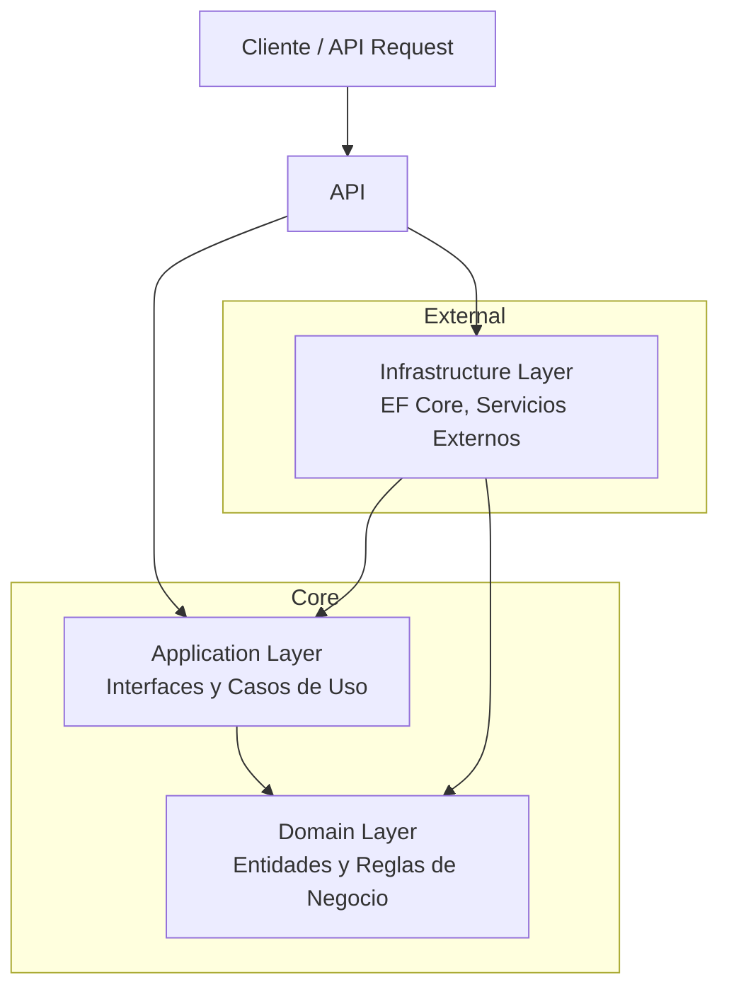

# Parhelion-WMS


Sistema de Gestión de Almacén y Logística (Warehouse Management System) para la administración de flotillas, choferes y envíos.

> **Estado del Proyecto:** En Desarrollo Activo (MVP)

---

## Descripción

**Parhelion-WMS** es una plataforma SaaS multi-tenant centralizada diseñada para resolver la fragmentación logística en empresas de transporte. Permite gestionar la operación completa desde una sola interfaz segura y escalable.

**Objetivo Técnico:** Implementación de **Clean Architecture** y **Domain-Driven Design (DDD)** en un entorno de producción utilizando .NET 8, Angular y contenedores Docker.

---

## Características (MVP)

- [x] Documentación de requerimientos y esquema de base de datos
- [ ] **Arquitectura Base:** Configuración de Clean Architecture y estructura de proyecto
- [ ] **Multi-tenancy:** Aislamiento de datos por cliente/empresa
- [ ] **Gestión de Flotilla:** Control de camiones y capacidades de carga
- [ ] **Gestión de Choferes:** Asignación dinámica o fija a unidades
- [ ] **Logística:** Validación de peso y asignación de rutas
- [ ] **Seguridad:** Autenticación JWT con roles (Admin/Chofer)
- [ ] **Dashboard:** KPIs operativos en tiempo real
- [ ] **Modo Demo:** Acceso para reclutadores sin registro previo

---

## Stack Tecnológico

| Capa                | Tecnología                            |
| :------------------ | :------------------------------------ |
| **Backend**         | C# / .NET 8 Web API                   |
| **Base de Datos**   | PostgreSQL 16                         |
| **ORM**             | Entity Framework Core (Code First)    |
| **Frontend**        | Angular 18+ (Material Design)         |
| **Infraestructura** | Docker Compose, Nginx (Reverse Proxy) |
| **Hosting**         | Digital Ocean Droplet (Linux)         |

---

## Arquitectura

El proyecto sigue estrictamente **Clean Architecture** para desacoplar la lógica de negocio de la infraestructura:



---

## Estructura del Proyecto

```
src/
├── Parhelion.Domain/         # Núcleo: Entidades y Excepciones (Sin dependencias)
├── Parhelion.Application/    # Reglas: DTOs, Interfaces, Validaciones
├── Parhelion.Infrastructure/ # Persistencia: DbContext, Repositorios, Migraciones
└── Parhelion.API/            # Entrada: Controllers, JWT Config, DI
```

---

## Quick Start

**Requisitos:** Docker y Docker Compose instalados.

```bash
# 1. Clonar el repositorio
git clone https://github.com/MetaCodeX/Parhelion-WMS.git
cd Parhelion-WMS

# 2. Levantar la infraestructura (BD y API)
docker-compose up --build
```

El API estará disponible en: `http://localhost:5000/swagger`

---

## Documentación

| Documento                                        | Descripción                                   |
| :----------------------------------------------- | :-------------------------------------------- |
| [Requerimientos (MVP)](./requirments.md)         | Especificación funcional completa del sistema |
| [Esquema de Base de Datos](./database-schema.md) | Diagrama ER y definiciones de entidades       |

---

## Despliegue

| Servicio        | URL                   |
| :-------------- | :-------------------- |
| **API Backend** | `api.macrostasis.lat` |
| **Frontend**    | `macrostasis.lat`     |

---

## Autor

**MetaCodeX** | 2025

_Proyecto desarrollado como portafolio profesional de Arquitectura de Software._
