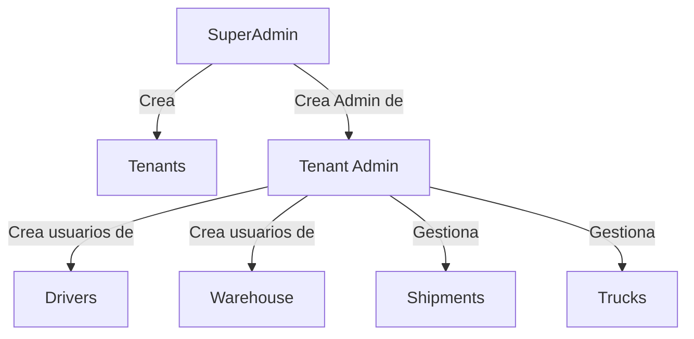
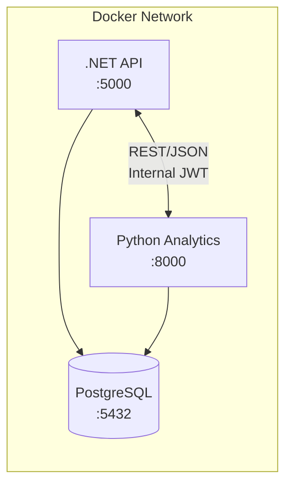

# Arquitectura de API - Parhelion Logistics

Documentacion tecnica de la estructura API-First del backend Parhelion.

## Estado Actual

**Version:** 0.6.0-alpha
**Enfoque:** Python Microservice Integration + Analytics Foundation
**Arquitectura:** Clean Architecture + Domain-Driven Design + Microservices

---

## Capas del API (API Layers)

El backend esta organizado en 5 capas logicas que agrupan los endpoints segun su dominio:

### Core Layer

Gestion de identidad, usuarios y estructura organizacional.

| Endpoint         | Entidad  | Estado   | Service         |
| ---------------- | -------- | -------- | --------------- |
| `/api/tenants`   | Tenant   | Services | TenantService   |
| `/api/users`     | User     | Services | UserService     |
| `/api/roles`     | Role     | Services | RoleService     |
| `/api/employees` | Employee | Services | EmployeeService |
| `/api/clients`   | Client   | Services | ClientService   |

### Warehouse Layer

Gestion de almacenes, zonas e inventario.

| Endpoint                      | Entidad              | Estado   | Service                     |
| ----------------------------- | -------------------- | -------- | --------------------------- |
| `/api/locations`              | Location             | Services | LocationService             |
| `/api/warehouse-zones`        | WarehouseZone        | Services | WarehouseZoneService        |
| `/api/warehouse-operators`    | WarehouseOperator    | Services | WarehouseOperatorService    |
| `/api/inventory-stocks`       | InventoryStock       | Services | InventoryStockService       |
| `/api/inventory-transactions` | InventoryTransaction | Services | InventoryTransactionService |

### Fleet Layer

Gestion de flotilla, choferes y turnos.

| Endpoint          | Entidad  | Estado   | Service         |
| ----------------- | -------- | -------- | --------------- |
| `/api/trucks`     | Truck    | Services | TruckService    |
| `/api/drivers`    | Driver   | Services | DriverService   |
| `/api/shifts`     | Shift    | Skeleton | -               |
| `/api/fleet-logs` | FleetLog | Services | FleetLogService |

### Shipment Layer

Gestion de envios, items y trazabilidad.

| Endpoint                    | Entidad            | Estado   | Service                   |
| --------------------------- | ------------------ | -------- | ------------------------- | -------------------------------------- |
| `/api/shipments`            | Shipment           | Services | ShipmentService           |
| `/api/shipment-items`       | ShipmentItem       | Services | ShipmentItemService       |
| `/api/shipment-checkpoints` | ShipmentCheckpoint | Services | ShipmentCheckpointService | `timeline/{id}`, `/by-status`, `/last` |
| `/api/shipment-documents`   | ShipmentDocument   | Services | ShipmentDocumentService   | `/pod/{id}`                            |
| `/api/documents`            | -                  | Services | PdfGeneratorService       | PDF Generation (v0.5.7)                |
| `/api/catalog-items`        | CatalogItem        | Services | CatalogItemService        |                                        |
| `/api/notifications`        | Notification       | Services | NotificationService       |                                        |

### Documents Layer (v0.5.7 NEW)

Generación dinámica de documentos PDF sin almacenamiento.

| Endpoint                                | Documento           | Entidad Input  |
| --------------------------------------- | ------------------- | -------------- |
| `GET /api/documents/service-order/{id}` | Orden de Servicio   | Shipment       |
| `GET /api/documents/waybill/{id}`       | Carta Porte         | Shipment       |
| `GET /api/documents/manifest/{id}`      | Manifiesto de Carga | RouteBlueprint |
| `GET /api/documents/trip-sheet/{id}`    | Hoja de Ruta        | Driver         |
| `GET /api/documents/pod/{id}`           | Proof of Delivery   | Shipment       |

> Los PDFs se generan on-demand con datos de BD. Cliente crea `blob:` URL local.

### Network Layer

Gestion de red logistica Hub and Spoke.

| Endpoint                | Entidad        | Estado   | Service            |
| ----------------------- | -------------- | -------- | ------------------ |
| `/api/network-links`    | NetworkLink    | Services | NetworkLinkService |
| `/api/route-blueprints` | RouteBlueprint | Services | RouteService       |
| `/api/route-steps`      | RouteStep      | Services | RouteStepService   |

---

## Services Layer (v0.5.2)

Capa de servicios que encapsula logica de negocio.

### Interfaces Base

| Interfaz             | Descripcion                               |
| -------------------- | ----------------------------------------- |
| `IGenericService<T>` | CRUD generico con paginacion y DTOs       |
| `ITenantService`     | Extiende IGenericService para Tenants     |
| `IUserService`       | Validacion de credenciales, cambio passwd |
| `IShipmentService`   | Tracking, asignacion, estatus             |

### Implementaciones por Capa

| Capa      | Services                                                               |
| --------- | ---------------------------------------------------------------------- |
| Core      | Tenant, User, Role, Employee, Client                                   |
| Shipment  | Shipment, ShipmentItem, Checkpoint, Document, Catalog                  |
| Fleet     | Driver, Truck, FleetLog                                                |
| Network   | Location, Route, NetworkLink, RouteStep                                |
| Warehouse | WarehouseZone, WarehouseOperator, InventoryStock, InventoryTransaction |

---

## Foundation Layer (v0.5.1)

Infraestructura base para operaciones CRUD y transacciones.

### Repository Pattern

| Interfaz                | Implementacion      | Descripcion                      |
| ----------------------- | ------------------- | -------------------------------- |
| `IGenericRepository<T>` | `GenericRepository` | CRUD generico con soft delete    |
| `ITenantRepository<T>`  | `TenantRepository`  | Filtrado automatico por TenantId |
| `IUnitOfWork`           | `UnitOfWork`        | Coordinacion de transacciones    |

---

## Autenticación y Autorización

### Autenticación JWT

Todos los endpoints protegidos requieren JWT Bearer token:

```http
Authorization: Bearer <access_token>
```

El token se obtiene via `/api/auth/login` con credenciales válidas.

### Flujo de Autorización Multi-Tenant

El sistema implementa un modelo de autorización jerárquico basado en roles:



| Rol              | Permisos                                                        | Restricciones                                               |
| ---------------- | --------------------------------------------------------------- | ----------------------------------------------------------- |
| **SuperAdmin**   | Crear Tenants, crear Admin users para cualquier Tenant          | No puede operar dentro de un Tenant (crear shipments, etc.) |
| **Tenant Admin** | CRUD completo de Users, Drivers, Trucks, Shipments de su Tenant | Solo acceso a datos de su propio Tenant                     |
| **Driver**       | Ver shipments asignados, actualizar estado, crear checkpoints   | Solo sus propios shipments                                  |
| **Warehouse**    | Cargar/descargar items, crear checkpoints de carga              | Solo en su ubicación asignada                               |

### Herencia de TenantId

Cuando un usuario crea entidades, el `TenantId` se asigna automáticamente:

- **SuperAdmin + `targetTenantId`**: Puede especificar el Tenant destino (solo para crear Admins)
- **Tenant Admin**: Todas las entidades heredan su `TenantId` automáticamente
- **Otros roles**: Heredan `TenantId` del contexto de la sesión

### ServiceApiKey (Agentes IA)

Para integraciones con n8n y agentes IA, cada Tenant tiene un `ServiceApiKey` generado automáticamente:

```http
X-Service-Api-Key: <api_key>
```

---

## Guía de Uso de la API

> **Nota:** En los ejemplos, `$API_BASE` representa la URL base de la API (ej. `https://api.example.com` o la URL de desarrollo).

### 1. Login y Obtención de Token

```bash
curl -X POST $API_BASE/api/auth/login \
  -H "Content-Type: application/json" \
  -d '{"email":"admin@example.com","password":"Password123!"}'
```

**Response:** `{ "accessToken": "eyJ...", "refreshToken": "..." }`

### 2. Crear Tenant (Solo SuperAdmin)

```bash
curl -X POST $API_BASE/api/tenants \
  -H "Authorization: Bearer <superadmin_token>" \
  -H "Content-Type: application/json" \
  -d '{
    "name": "TransporteMX",
    "legalName": "Transportes MX SA de CV",
    "rfc": "TMX010101ABC",
    "fleetSize": 10,
    "driverCount": 5
  }'
```

### 3. Crear Admin de Otro Tenant (Solo SuperAdmin)

```bash
curl -X POST $API_BASE/api/users \
  -H "Authorization: Bearer <superadmin_token>" \
  -H "Content-Type: application/json" \
  -d '{
    "email": "admin@newtenant.com",
    "password": "SecurePass123!",
    "fullName": "Admin Nuevo",
    "roleId": "11111111-1111-1111-1111-111111111111",
    "targetTenantId": "<tenant_id_destino>"
  }'
```

> **Importante:** Solo SuperAdmin puede usar `targetTenantId`. Tenant Admins crean usuarios que heredan su propio TenantId.

### 4. Crear Usuario en Mi Tenant (Como Tenant Admin)

```bash
curl -X POST $API_BASE/api/users \
  -H "Authorization: Bearer <tenant_admin_token>" \
  -H "Content-Type: application/json" \
  -d '{
    "email": "driver@mytenant.com",
    "password": "DriverPass123!",
    "fullName": "Chofer Nuevo",
    "roleId": "22222222-2222-2222-2222-222222222222"
  }'
```

### 5. Crear Location

```bash
curl -X POST $API_BASE/api/locations \
  -H "Authorization: Bearer <token>" \
  -H "Content-Type: application/json" \
  -d '{
    "code": "MTY",
    "name": "Hub Monterrey",
    "fullAddress": "Av Industrial 500, Monterrey NL",
    "type": "RegionalHub",
    "latitude": 25.6866,
    "longitude": -100.3161,
    "isInternal": true,
    "canReceive": true,
    "canDispatch": true
  }'
```

### 6. Crear Shipment

```bash
curl -X POST $API_BASE/api/shipments \
  -H "Authorization: Bearer <token>" \
  -H "Content-Type: application/json" \
  -d '{
    "originLocationId": "<origin_uuid>",
    "destinationLocationId": "<dest_uuid>",
    "recipientName": "Cliente Final",
    "recipientPhone": "5512345678",
    "totalWeightKg": 100.5,
    "totalVolumeM3": 0.5,
    "priority": "Standard"
  }'
```

### Role IDs de Referencia

| Rol        | ID                                     |
| ---------- | -------------------------------------- |
| SuperAdmin | `00000000-0000-0000-0000-000000000001` |
| Admin      | `11111111-1111-1111-1111-111111111111` |
| Driver     | `22222222-2222-2222-2222-222222222222` |
| DemoUser   | `33333333-3333-3333-3333-333333333333` |
| Warehouse  | `44444444-4444-4444-4444-444444444444` |

---

## Health Endpoints

| Endpoint         | Descripcion                   |
| ---------------- | ----------------------------- |
| `GET /health`    | Estado del servicio           |
| `GET /health/db` | Conectividad de base de datos |

---

## Base de Datos

- **Tablas:** 24
- **Migraciones:** Aplicadas (EF Core Code First)
- **Provider:** PostgreSQL 17

---

## Tests (xUnit)

| Test Suite               | Tests   | Cobertura                  |
| ------------------------ | ------- | -------------------------- |
| `PaginationDtoTests`     | 11      | PagedRequest, PagedResult  |
| `GenericRepositoryTests` | 9       | CRUD, Soft Delete, Queries |
| `ServiceTests`           | 72      | All Services               |
| `BusinessRulesTests`     | 30      | Compatibility, FleetLog    |
| **Total**                | **122** | Full backend coverage      |

---

## Python Analytics Service (v0.6.0+)

Microservicio local para análisis avanzado, predicciones y reportes.

### Tecnologías

| Componente | Tecnología               |
| ---------- | ------------------------ |
| Framework  | FastAPI 0.115+           |
| Runtime    | Python 3.12+             |
| ORM        | SQLAlchemy 2.0 + asyncpg |
| Validación | Pydantic v2              |
| Testing    | pytest + pytest-asyncio  |

### Endpoints Python

| Endpoint                      | Método | Descripción                      |
| ----------------------------- | ------ | -------------------------------- |
| `/health`                     | GET    | Estado del servicio              |
| `/health/db`                  | GET    | Conectividad PostgreSQL          |
| `/api/py/analytics/shipments` | GET    | Análisis de envíos por período   |
| `/api/py/analytics/fleet`     | GET    | Métricas de utilización de flota |
| `/api/py/predictions/eta`     | POST   | Predicción de ETA con ML         |
| `/api/py/reports/export`      | POST   | Generación de reportes Excel     |

### Autenticación Python

Requiere header `X-Internal-Service-Key` para llamadas desde .NET API,
o `Authorization: Bearer <jwt>` para llamadas desde n8n.

### Comunicación Inter-Servicios



---

## Pendientes (v0.7.0+)

Los siguientes items quedan pendientes para futuras versiones:

- [ ] QR Handshake (Transferencia de custodia digital via QR)
- [ ] Route Assignment (Asignación de rutas a shipments)
- [ ] Dashboard (KPIs operativos con procesamiento Python)
- [ ] Predicción ETA con ML (Python)
- [ ] Exportación Excel dinámica (Python + pandas)
- [ ] Recuperación de contraseña
- [ ] Demo Mode para reclutadores

---

## Notas de Desarrollo

La gestion de endpoints durante desarrollo utiliza herramientas privadas que no forman parte del repositorio. Estas herramientas contienen credenciales y configuraciones sensibles que no deben exponerse publicamente.

---

**Ultima actualizacion:** 2025-12-29
