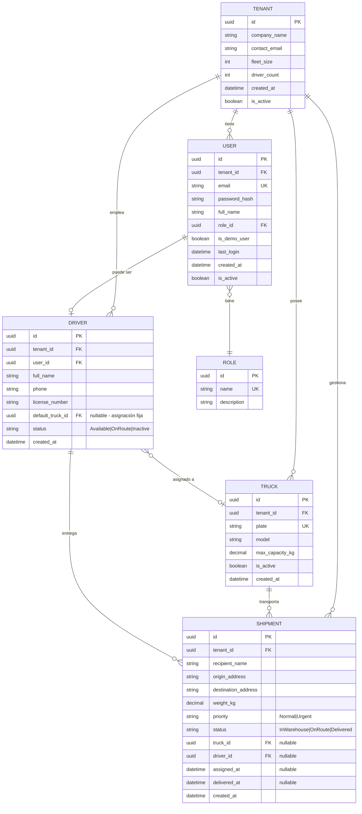
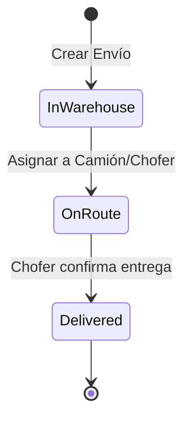
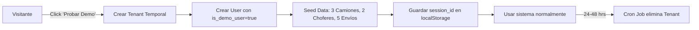

# PARHELION-WMS | Modelo de Base de Datos

**Versión:** 1.0
**Fecha:** Diciembre 2025
**Motor:** PostgreSQL + Entity Framework Core (Code First)

---

## 1. Diagrama Entidad-Relación (ER)



---

## 2. Descripción de Entidades

### Sistema Multi-Tenant

| Tabla    | Propósito                                                                    |
| -------- | ---------------------------------------------------------------------------- |
| `TENANT` | Representa a cada cliente/empresa que usa el sistema. Aísla todos los datos. |
| `USER`   | Usuarios del sistema (Admin, Chofer, Demo). Siempre pertenece a un Tenant.   |
| `ROLE`   | Roles del sistema: `Admin`, `Driver`, `DemoUser`.                            |

### Operaciones

| Tabla      | Propósito                                                                                |
| ---------- | ---------------------------------------------------------------------------------------- |
| `DRIVER`   | Choferes de la flotilla. Puede tener un camión fijo (`default_truck_id`) o ser dinámico. |
| `TRUCK`    | Camiones de la flotilla con capacidad máxima en kg.                                      |
| `SHIPMENT` | Envíos/paquetes con origen, destino, peso y estatus.                                     |

---

## 3. Roles del Sistema (Seed Data)

```sql
INSERT INTO roles (id, name, description) VALUES
  ('11111111-1111-1111-1111-111111111111', 'Admin', 'Gerente de Tráfico - Acceso total'),
  ('22222222-2222-2222-2222-222222222222', 'Driver', 'Chofer - Solo ve sus envíos'),
  ('33333333-3333-3333-3333-333333333333', 'DemoUser', 'Usuario de demostración temporal');
```

---

## 4. Estatus de Envío (Estado Machine)



| Estatus    | Código        | Descripción                              |
| ---------- | ------------- | ---------------------------------------- |
| En Almacén | `InWarehouse` | Paquete registrado, esperando asignación |
| En Ruta    | `OnRoute`     | Asignado a camión y chofer, en tránsito  |
| Entregado  | `Delivered`   | Chofer confirmó la entrega               |

---

## 5. Estatus de Chofer

| Estatus    | Código      | Descripción                            |
| ---------- | ----------- | -------------------------------------- |
| Disponible | `Available` | Puede recibir nuevos envíos            |
| En Ruta    | `OnRoute`   | Actualmente entregando paquetes        |
| Inactivo   | `Inactive`  | No disponible (vacaciones, baja, etc.) |

---

## 6. Índices Recomendados

```sql
-- Búsquedas frecuentes
CREATE INDEX idx_shipment_tenant_status ON shipments(tenant_id, status);
CREATE INDEX idx_shipment_driver ON shipments(driver_id) WHERE driver_id IS NOT NULL;
CREATE INDEX idx_driver_tenant_status ON drivers(tenant_id, status);
CREATE INDEX idx_truck_tenant_plate ON trucks(tenant_id, plate);

-- Unicidad compuesta
CREATE UNIQUE INDEX idx_truck_plate_per_tenant ON trucks(tenant_id, plate);
CREATE UNIQUE INDEX idx_user_email ON users(email);
```

---

## 7. Reglas de Negocio (Constraints)

| Regla                      | Implementación                                                   |
| -------------------------- | ---------------------------------------------------------------- |
| **Validación de Peso**     | `CHECK` en backend: `SUM(shipment.weight) <= truck.max_capacity` |
| **Placa Única por Tenant** | `UNIQUE(tenant_id, plate)`                                       |
| **Email Único Global**     | `UNIQUE(email)` en tabla Users                                   |
| **Tenant Isolation**       | Todas las queries filtran por `tenant_id`                        |

---

## 8. Usuarios Demo (Sesión Temporal)

Para el **Módulo 10 (Demo Pública)**, los usuarios demo se manejan así:



| Campo                 | Valor para Demo                 |
| --------------------- | ------------------------------- |
| `tenant.company_name` | `Demo-{UUID}`                   |
| `user.is_demo_user`   | `true`                          |
| `tenant.created_at`   | Se usa para calcular expiración |

---

## 9. Mapeo a C# (Entity Framework)

```csharp
// Ejemplo de entidad Tenant
public class Tenant
{
    public Guid Id { get; set; }
    public string CompanyName { get; set; } = null!;
    public string ContactEmail { get; set; } = null!;
    public int FleetSize { get; set; }
    public int DriverCount { get; set; }
    public DateTime CreatedAt { get; set; }
    public bool IsActive { get; set; }

    // Navigation Properties
    public ICollection<User> Users { get; set; } = new List<User>();
    public ICollection<Truck> Trucks { get; set; } = new List<Truck>();
    public ICollection<Driver> Drivers { get; set; } = new List<Driver>();
    public ICollection<Shipment> Shipments { get; set; } = new List<Shipment>();
}

// Ejemplo de entidad Shipment
public class Shipment
{
    public Guid Id { get; set; }
    public Guid TenantId { get; set; }
    public string RecipientName { get; set; } = null!;
    public string OriginAddress { get; set; } = null!;
    public string DestinationAddress { get; set; } = null!;
    public decimal WeightKg { get; set; }
    public ShipmentPriority Priority { get; set; }
    public ShipmentStatus Status { get; set; }
    public Guid? TruckId { get; set; }
    public Guid? DriverId { get; set; }
    public DateTime? AssignedAt { get; set; }
    public DateTime? DeliveredAt { get; set; }
    public DateTime CreatedAt { get; set; }

    // Navigation Properties
    public Tenant Tenant { get; set; } = null!;
    public Truck? Truck { get; set; }
    public Driver? Driver { get; set; }
}

public enum ShipmentStatus { InWarehouse, OnRoute, Delivered }
public enum ShipmentPriority { Normal, Urgent }
public enum DriverStatus { Available, OnRoute, Inactive }
```

---

**Siguiente Paso:** Usar este esquema para generar las migraciones de Entity Framework Core.
