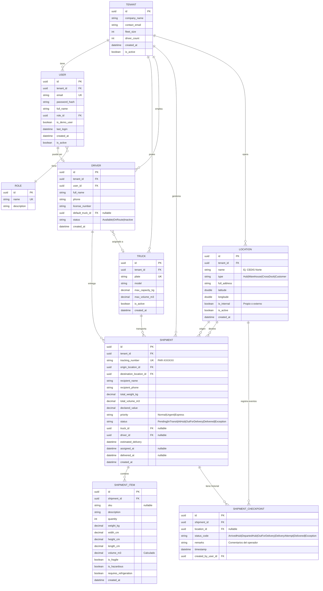
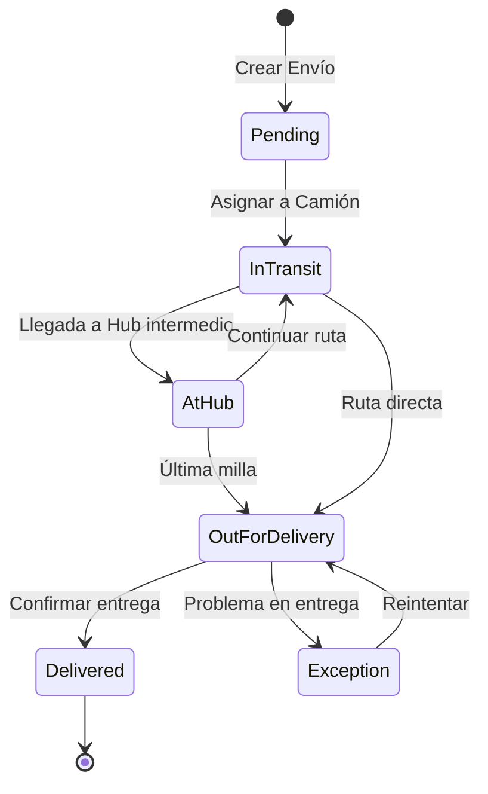
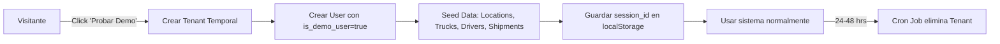

# PARHELION-WMS | Modelo de Base de Datos

**Versión:** 2.0 (Enterprise)
**Fecha:** Diciembre 2025
**Motor:** PostgreSQL + Entity Framework Core (Code First)

---

## 1. Diagrama Entidad-Relación (ER) - Vista General



---

## 2. Módulos del Sistema

### 2.1 Módulo Core (Multi-Tenant)

| Tabla    | Propósito                                                                    |
| -------- | ---------------------------------------------------------------------------- |
| `TENANT` | Representa a cada cliente/empresa que usa el sistema. Aísla todos los datos. |
| `USER`   | Usuarios del sistema (Admin, Chofer, Demo). Siempre pertenece a un Tenant.   |
| `ROLE`   | Roles del sistema: `Admin`, `Driver`, `DemoUser`.                            |

### 2.2 Módulo de Flotilla

| Tabla    | Propósito                                                                                |
| -------- | ---------------------------------------------------------------------------------------- |
| `DRIVER` | Choferes de la flotilla. Puede tener un camión fijo (`default_truck_id`) o ser dinámico. |
| `TRUCK`  | Camiones de la flotilla con capacidad máxima en kg y volumen en m3.                      |

### 2.3 Módulo de Red Logística (Locations)

Este módulo permite gestionar **nodos de la red logística**: almacenes propios, centros de distribución (CEDIS), cross-docks y ubicaciones de clientes.

| Tabla      | Propósito                                                               |
| ---------- | ----------------------------------------------------------------------- |
| `LOCATION` | Sedes y nodos de la red. Almacenes, Hubs, Cross-docks, puntos de venta. |

**Tipos de Ubicación:**

| Tipo       | Código      | Descripción                                    |
| ---------- | ----------- | ---------------------------------------------- |
| Almacén    | `Warehouse` | Bodega de almacenamiento prolongado            |
| Hub/CEDIS  | `Hub`       | Centro de distribución, punto de consolidación |
| Cross-dock | `CrossDock` | Transferencia rápida sin almacenamiento        |
| Cliente    | `Customer`  | Ubicación final del destinatario               |

### 2.4 Módulo de Envíos (Shipments)

| Tabla      | Propósito                                                       |
| ---------- | --------------------------------------------------------------- |
| `SHIPMENT` | Envío principal con origen, destino, peso total y trazabilidad. |

**Número de Tracking:** Cada envío genera un código único con formato `PAR-XXXXXX` para seguimiento público.

### 2.5 Módulo de Manifiesto (Shipment Items)

Detalla el contenido de cada envío. Permite calcular **peso volumétrico** para cotizaciones precisas.

| Tabla           | Propósito                                                          |
| --------------- | ------------------------------------------------------------------ |
| `SHIPMENT_ITEM` | Partidas individuales dentro de un envío (SKU, dimensiones, peso). |

**Cálculo de Peso Volumétrico:**

```
Peso Volumétrico (kg) = (Largo cm × Ancho cm × Alto cm) / 5000
Peso Facturable = MAX(Peso Real, Peso Volumétrico)
```

**Flags Especiales:**

| Flag                     | Uso                                         |
| ------------------------ | ------------------------------------------- |
| `is_fragile`             | Requiere manejo cuidadoso                   |
| `is_hazardous`           | Material peligroso (HAZMAT)                 |
| `requires_refrigeration` | Cadena de frío (perecederos, farmacéuticos) |

### 2.6 Módulo de Trazabilidad (Checkpoints)

Bitácora de eventos del envío. Cada escaneo, movimiento o excepción genera un registro.

| Tabla                 | Propósito                                                       |
| --------------------- | --------------------------------------------------------------- |
| `SHIPMENT_CHECKPOINT` | Historial de eventos: llegadas, salidas, intentos, excepciones. |

**Códigos de Checkpoint:**

| Código            | Descripción                                   |
| ----------------- | --------------------------------------------- |
| `ArrivedHub`      | Llegó a un Hub/CEDIS                          |
| `DepartedHub`     | Salió del Hub hacia siguiente destino         |
| `OutForDelivery`  | En camino al destinatario final               |
| `DeliveryAttempt` | Intento de entrega (puede incluir motivo)     |
| `Delivered`       | Entregado exitosamente                        |
| `Exception`       | Problema: dirección incorrecta, rechazo, etc. |

---

## 3. Flujo de Estados del Envío



| Estatus         | Código           | Descripción                                |
| --------------- | ---------------- | ------------------------------------------ |
| Pendiente       | `Pending`        | Envío registrado, esperando asignación     |
| En Tránsito     | `InTransit`      | En movimiento entre ubicaciones            |
| En Hub          | `AtHub`          | Temporalmente en un centro de distribución |
| En Última Milla | `OutForDelivery` | En camino al destinatario final            |
| Entregado       | `Delivered`      | Entrega confirmada                         |
| Excepción       | `Exception`      | Problema que requiere atención             |

---

## 4. Estatus de Chofer

| Estatus    | Código      | Descripción                            |
| ---------- | ----------- | -------------------------------------- |
| Disponible | `Available` | Puede recibir nuevos envíos            |
| En Ruta    | `OnRoute`   | Actualmente entregando paquetes        |
| Inactivo   | `Inactive`  | No disponible (vacaciones, baja, etc.) |

---

## 5. Roles del Sistema (Seed Data)

```sql
INSERT INTO roles (id, name, description) VALUES
  ('11111111-1111-1111-1111-111111111111', 'Admin', 'Gerente de Tráfico - Acceso total'),
  ('22222222-2222-2222-2222-222222222222', 'Driver', 'Chofer - Solo ve sus envíos'),
  ('33333333-3333-3333-3333-333333333333', 'DemoUser', 'Usuario de demostración temporal');
```

---

## 6. Índices Recomendados

```sql
-- Core
CREATE INDEX idx_shipment_tenant_status ON shipments(tenant_id, status);
CREATE INDEX idx_shipment_driver ON shipments(driver_id) WHERE driver_id IS NOT NULL;
CREATE INDEX idx_driver_tenant_status ON drivers(tenant_id, status);
CREATE INDEX idx_truck_tenant_plate ON trucks(tenant_id, plate);

-- Trazabilidad
CREATE INDEX idx_checkpoint_shipment ON shipment_checkpoints(shipment_id);
CREATE INDEX idx_checkpoint_timestamp ON shipment_checkpoints(timestamp DESC);
CREATE INDEX idx_shipment_tracking ON shipments(tracking_number);

-- Red Logística
CREATE INDEX idx_location_tenant_type ON locations(tenant_id, type);
CREATE INDEX idx_shipment_origin ON shipments(origin_location_id);
CREATE INDEX idx_shipment_destination ON shipments(destination_location_id);

-- Unicidad
CREATE UNIQUE INDEX idx_truck_plate_per_tenant ON trucks(tenant_id, plate);
CREATE UNIQUE INDEX idx_user_email ON users(email);
CREATE UNIQUE INDEX idx_shipment_tracking_unique ON shipments(tracking_number);
```

---

## 7. Reglas de Negocio (Constraints)

| Regla                      | Implementación                                          |
| -------------------------- | ------------------------------------------------------- |
| **Validación de Peso**     | `SUM(items.weight_kg) <= truck.max_capacity_kg`         |
| **Validación de Volumen**  | `SUM(items.volume_m3) <= truck.max_volume_m3`           |
| **Placa Única por Tenant** | `UNIQUE(tenant_id, plate)`                              |
| **Tracking Único Global**  | `UNIQUE(tracking_number)`                               |
| **Email Único Global**     | `UNIQUE(email)` en tabla Users                          |
| **Tenant Isolation**       | Todas las queries filtran por `tenant_id`               |
| **Checkpoint Inmutable**   | Los checkpoints no se modifican, solo se agregan nuevos |

---

## 8. Usuarios Demo (Sesión Temporal)

Para el **Módulo Demo**, los usuarios temporales se manejan así:



| Campo                 | Valor para Demo                 |
| --------------------- | ------------------------------- |
| `tenant.company_name` | `Demo-{UUID}`                   |
| `user.is_demo_user`   | `true`                          |
| `tenant.created_at`   | Se usa para calcular expiración |

---

## 9. Mapeo a C# (Entity Framework)

### Entidad Location

```csharp
public class Location
{
    public Guid Id { get; set; }
    public Guid TenantId { get; set; }
    public string Name { get; set; } = null!;
    public LocationType Type { get; set; }
    public string FullAddress { get; set; } = null!;
    public double Latitude { get; set; }
    public double Longitude { get; set; }
    public bool IsInternal { get; set; }
    public bool IsActive { get; set; }
    public DateTime CreatedAt { get; set; }

    // Navigation Properties
    public Tenant Tenant { get; set; } = null!;
    public ICollection<Shipment> OriginShipments { get; set; } = new List<Shipment>();
    public ICollection<Shipment> DestinationShipments { get; set; } = new List<Shipment>();
    public ICollection<ShipmentCheckpoint> Checkpoints { get; set; } = new List<ShipmentCheckpoint>();
}

public enum LocationType { Warehouse, Hub, CrossDock, Customer }
```

### Entidad Shipment

```csharp
public class Shipment
{
    public Guid Id { get; set; }
    public Guid TenantId { get; set; }
    public string TrackingNumber { get; set; } = null!;
    public Guid OriginLocationId { get; set; }
    public Guid DestinationLocationId { get; set; }
    public string RecipientName { get; set; } = null!;
    public string? RecipientPhone { get; set; }
    public decimal TotalWeightKg { get; set; }
    public decimal TotalVolumeM3 { get; set; }
    public decimal? DeclaredValue { get; set; }
    public ShipmentPriority Priority { get; set; }
    public ShipmentStatus Status { get; set; }
    public Guid? TruckId { get; set; }
    public Guid? DriverId { get; set; }
    public DateTime? EstimatedDelivery { get; set; }
    public DateTime? AssignedAt { get; set; }
    public DateTime? DeliveredAt { get; set; }
    public DateTime CreatedAt { get; set; }

    // Navigation Properties
    public Tenant Tenant { get; set; } = null!;
    public Location OriginLocation { get; set; } = null!;
    public Location DestinationLocation { get; set; } = null!;
    public Truck? Truck { get; set; }
    public Driver? Driver { get; set; }
    public ICollection<ShipmentItem> Items { get; set; } = new List<ShipmentItem>();
    public ICollection<ShipmentCheckpoint> History { get; set; } = new List<ShipmentCheckpoint>();
}

public enum ShipmentStatus { Pending, InTransit, AtHub, OutForDelivery, Delivered, Exception }
public enum ShipmentPriority { Normal, Urgent, Express }
```

### Entidad ShipmentItem

```csharp
public class ShipmentItem
{
    public Guid Id { get; set; }
    public Guid ShipmentId { get; set; }
    public string? Sku { get; set; }
    public string Description { get; set; } = null!;
    public int Quantity { get; set; }
    public decimal WeightKg { get; set; }
    public decimal WidthCm { get; set; }
    public decimal HeightCm { get; set; }
    public decimal LengthCm { get; set; }
    public decimal VolumeM3 => (WidthCm * HeightCm * LengthCm) / 1_000_000;
    public bool IsFragile { get; set; }
    public bool IsHazardous { get; set; }
    public bool RequiresRefrigeration { get; set; }
    public DateTime CreatedAt { get; set; }

    // Navigation Properties
    public Shipment Shipment { get; set; } = null!;
}
```

### Entidad ShipmentCheckpoint

```csharp
public class ShipmentCheckpoint
{
    public Guid Id { get; set; }
    public Guid ShipmentId { get; set; }
    public Guid? LocationId { get; set; }
    public CheckpointStatus StatusCode { get; set; }
    public string? Remarks { get; set; }
    public DateTime Timestamp { get; set; }
    public Guid CreatedByUserId { get; set; }

    // Navigation Properties
    public Shipment Shipment { get; set; } = null!;
    public Location? Location { get; set; }
    public User CreatedBy { get; set; } = null!;
}

public enum CheckpointStatus { ArrivedHub, DepartedHub, OutForDelivery, DeliveryAttempt, Delivered, Exception }
```

### Entidad Tenant (Actualizada)

```csharp
public class Tenant
{
    public Guid Id { get; set; }
    public string CompanyName { get; set; } = null!;
    public string ContactEmail { get; set; } = null!;
    public int FleetSize { get; set; }
    public int DriverCount { get; set; }
    public DateTime CreatedAt { get; set; }
    public bool IsActive { get; set; }

    // Navigation Properties
    public ICollection<User> Users { get; set; } = new List<User>();
    public ICollection<Truck> Trucks { get; set; } = new List<Truck>();
    public ICollection<Driver> Drivers { get; set; } = new List<Driver>();
    public ICollection<Location> Locations { get; set; } = new List<Location>();
    public ICollection<Shipment> Shipments { get; set; } = new List<Shipment>();
}
```

---

## 10. Enumeraciones Completas

```csharp
// Estados del Sistema
public enum ShipmentStatus { Pending, InTransit, AtHub, OutForDelivery, Delivered, Exception }
public enum ShipmentPriority { Normal, Urgent, Express }
public enum DriverStatus { Available, OnRoute, Inactive }
public enum LocationType { Warehouse, Hub, CrossDock, Customer }
public enum CheckpointStatus { ArrivedHub, DepartedHub, OutForDelivery, DeliveryAttempt, Delivered, Exception }
```

---

**Siguiente Paso:** Usar este esquema para generar las migraciones de Entity Framework Core con `dotnet ef migrations add InitialCreate`.
