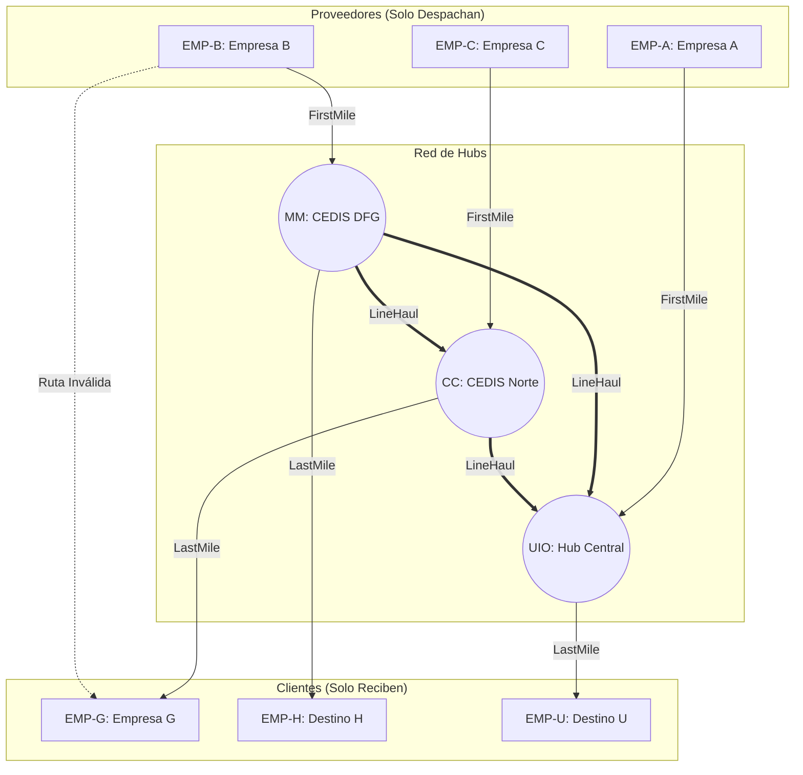
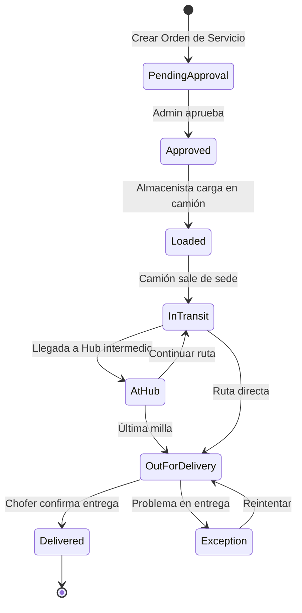
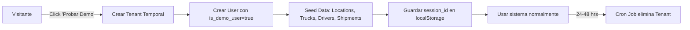
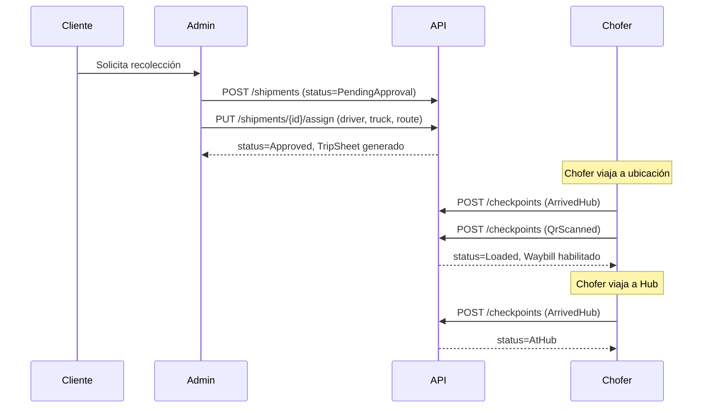
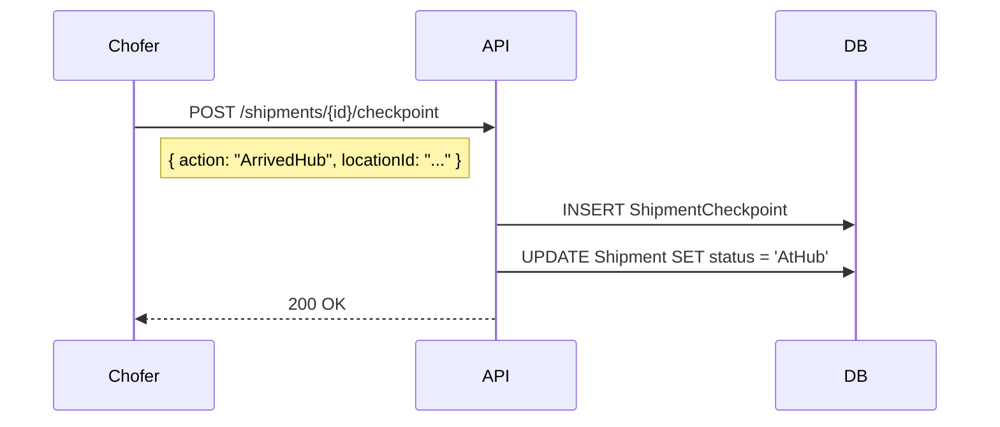
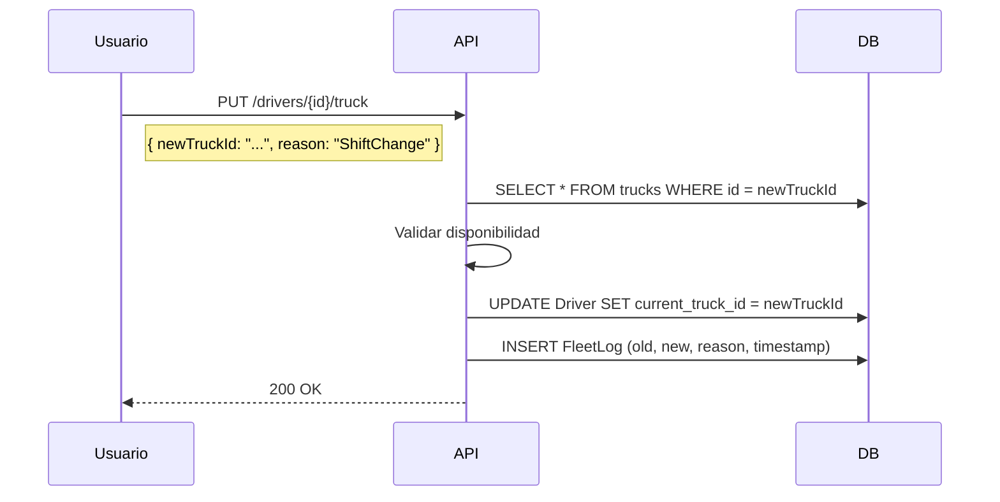
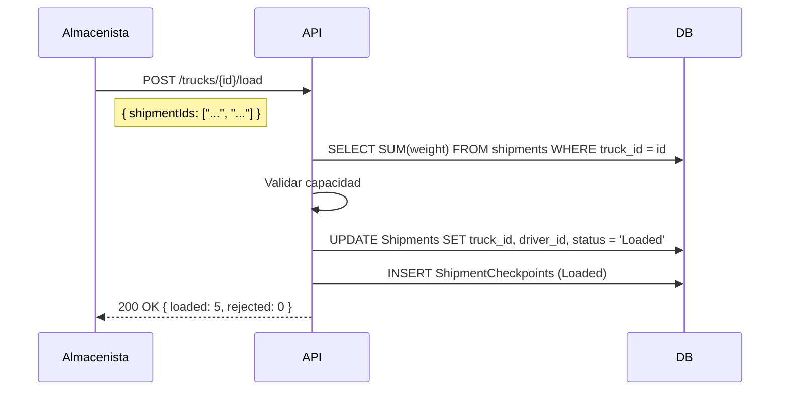
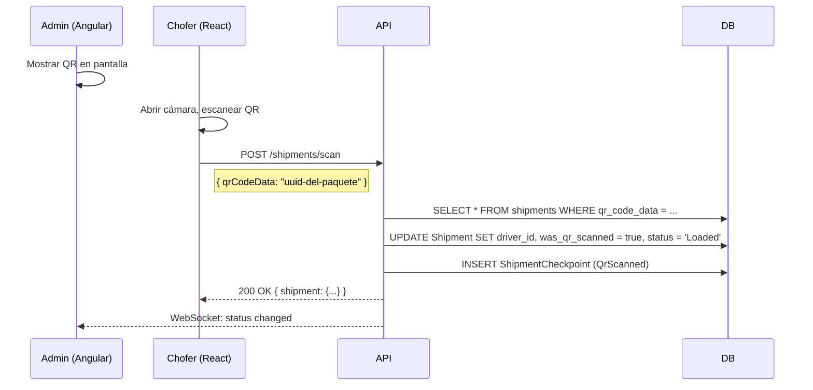

# PARHELION-LOGISTICS | Modelo de Base de Datos

**Versión:** 2.4 (v0.4.3 - Employee Layer)  
**Fecha:** Diciembre 2025  
**Motor:** PostgreSQL + Entity Framework Core (Code First)  
**Estado:** Diseño Cerrado - Listo para Implementación

> **Nota Técnica:** Esta plataforma unifica WMS (Warehouse Management System) y TMS (Transportation Management System). El módulo de almacén gestiona inventario estático y carga, mientras que el núcleo TMS maneja logística de media milla: gestión de flotas tipificadas, redes Hub & Spoke y trazabilidad de envíos en movimiento.

> **v0.4.3:** Agrega Employee Layer (centraliza datos legales), Shift (turnos), WarehouseZone (zonas de bodega), WarehouseOperator (extensión de empleado para almacenistas), y SuperAdmin (IsSuperAdmin en User).

---

## 1. Diagrama Entidad-Relación (ER) - Vista General

```mermaid
erDiagram
    %% ========== SISTEMA Y ACCESO ==========
    TENANT ||--o{ USER : "tiene"
    TENANT ||--o{ TRUCK : "posee"
    TENANT ||--o{ DRIVER : "emplea"
    TENANT ||--o{ SHIPMENT : "gestiona"
    TENANT ||--o{ LOCATION : "opera"

    USER ||--o| DRIVER : "puede ser"
    USER }o--|| ROLE : "tiene"

    %% ========== RED LOGÍSTICA ==========
    LOCATION ||--o{ SHIPMENT : "origen"
    LOCATION ||--o{ SHIPMENT : "destino"
    LOCATION ||--o{ SHIPMENT_CHECKPOINT : "registra eventos"
    LOCATION ||--o{ ROUTE_STEP : "parada en ruta"
    LOCATION ||--o{ NETWORK_LINK : "origen de enlace"
    LOCATION ||--o{ NETWORK_LINK : "destino de enlace"

    %% ========== ENRUTAMIENTO (HUB & SPOKE) ==========
    TENANT ||--o{ ROUTE_BLUEPRINT : "define rutas"
    TENANT ||--o{ NETWORK_LINK : "define enlaces de red"
    ROUTE_BLUEPRINT ||--o{ ROUTE_STEP : "tiene paradas"
    ROUTE_BLUEPRINT ||--o{ SHIPMENT : "asignada a envíos"

    %% ========== OPERACIONES ==========
    TRUCK ||--o{ SHIPMENT : "transporta"
    DRIVER ||--o{ SHIPMENT : "entrega"
    DRIVER }o--o| TRUCK : "conduce actualmente"

    %% ========== TRAZABILIDAD ==========
    SHIPMENT ||--o{ SHIPMENT_ITEM : "contiene"
    SHIPMENT ||--o{ SHIPMENT_CHECKPOINT : "tiene historial"
    SHIPMENT ||--o{ SHIPMENT_DOCUMENT : "genera documentos"

    %% ========== HISTÓRICOS ==========
    DRIVER ||--o{ FLEET_LOG : "historial cambios vehículo"

    %% ========== CLIENTES Y AUTH (v0.4.2) ==========
    TENANT ||--o{ CLIENT : "tiene clientes"
    CLIENT ||--o{ SHIPMENT : "envía como remitente"
    CLIENT ||--o{ SHIPMENT : "recibe como destinatario"
    USER ||--o{ REFRESH_TOKEN : "tiene tokens"
    DRIVER ||--o{ SHIPMENT_CHECKPOINT : "maneja paquetes"
    TRUCK ||--o{ SHIPMENT_CHECKPOINT : "carga paquetes"

    %% ========== EMPLOYEE LAYER (v0.4.3) ==========
    TENANT ||--o{ EMPLOYEE : "emplea"
    TENANT ||--o{ SHIFT : "define turnos"
    USER ||--o| EMPLOYEE : "tiene perfil de empleado"
    EMPLOYEE ||--o| DRIVER : "extensión chofer"
    EMPLOYEE ||--o| WAREHOUSE_OPERATOR : "extensión almacenista"
    EMPLOYEE }o--o| SHIFT : "tiene turno"
    LOCATION ||--o{ WAREHOUSE_ZONE : "tiene zonas"
    LOCATION ||--o{ WAREHOUSE_OPERATOR : "asigna operadores"
    WAREHOUSE_ZONE ||--o{ WAREHOUSE_OPERATOR : "asigna a zona"
    WAREHOUSE_OPERATOR ||--o{ SHIPMENT_CHECKPOINT : "maneja paquetes"

    %% ========== ENTIDADES CORE ==========
    TENANT {
        uuid id PK
        string company_name
        string contact_email
        int fleet_size
        int driver_count
        boolean is_active
        datetime created_at
        datetime updated_at "nullable"
        boolean is_deleted
        datetime deleted_at "nullable"
        datetime updated_at "nullable"
        boolean is_deleted
        datetime deleted_at "nullable"
    }

    USER {
        uuid id PK
        uuid tenant_id FK
        string email UK
        string password_hash
        string full_name
        uuid role_id FK
        boolean is_demo_user
        boolean uses_argon2 "True si usa Argon2id"
        boolean is_super_admin "v0.4.3 - SuperAdmin del sistema"
        datetime last_login "nullable"
        boolean is_active
        datetime created_at
        datetime updated_at "nullable"
        boolean is_deleted
        datetime deleted_at "nullable"
    }

    ROLE {
        uuid id PK
        string name UK
        string description
        datetime created_at
        datetime updated_at "nullable"
        boolean is_deleted
        datetime deleted_at "nullable"
        datetime updated_at "nullable"
        boolean is_deleted
        datetime deleted_at "nullable"
    }

    DRIVER {
        uuid id PK
        uuid employee_id FK "v0.4.3 - Referencia a Employee"
        string license_number
        string license_type "nullable - A|B|C|D|E"
        datetime license_expiration "nullable"
        uuid default_truck_id FK "nullable - asignación fija"
        uuid current_truck_id FK "nullable - camión actual"
        string status "Available|OnRoute|Inactive"
        datetime created_at
        datetime updated_at "nullable"
        boolean is_deleted
        datetime deleted_at "nullable"
    }

    %% ========== EMPLOYEE LAYER ENTITIES (v0.4.3) ==========
    EMPLOYEE {
        uuid id PK
        uuid tenant_id FK
        uuid user_id FK "UK - 1:1 con User"
        string phone
        string rfc "nullable - RFC fiscal"
        string nss "nullable - Número de Seguro Social"
        string curp "nullable - CURP"
        string emergency_contact "nullable"
        string emergency_phone "nullable"
        datetime hire_date "nullable"
        uuid shift_id FK "nullable"
        string department "nullable - Admin|Operations|Field"
        datetime created_at
        datetime updated_at "nullable"
        boolean is_deleted
        datetime deleted_at "nullable"
    }

    SHIFT {
        uuid id PK
        uuid tenant_id FK
        string name "Matutino|Vespertino|Nocturno"
        time start_time
        time end_time
        string days_of_week "Mon,Tue,Wed,Thu,Fri"
        boolean is_active
        datetime created_at
        datetime updated_at "nullable"
        boolean is_deleted
        datetime deleted_at "nullable"
    }

    WAREHOUSE_ZONE {
        uuid id PK
        uuid location_id FK
        string code "UK - A1, B2, COLD-1"
        string name
        string type "Receiving|Storage|Staging|Shipping|ColdChain|Hazmat"
        boolean is_active
        datetime created_at
        datetime updated_at "nullable"
        boolean is_deleted
        datetime deleted_at "nullable"
    }

    WAREHOUSE_OPERATOR {
        uuid id PK
        uuid employee_id FK "UK - 1:1 con Employee"
        uuid assigned_location_id FK
        uuid primary_zone_id FK "nullable"
        datetime created_at
        datetime updated_at "nullable"
        boolean is_deleted
        datetime deleted_at "nullable"
    }

    TRUCK {
        uuid id PK
        uuid tenant_id FK
        string plate UK
        string model
        string type "DryBox|Refrigerated|HazmatTank|Flatbed|Armored"
        decimal max_capacity_kg
        decimal max_volume_m3
        boolean is_active
        string vin "nullable - VIN"
        string engine_number "nullable"
        int year "nullable"
        string color "nullable"
        string insurance_policy "nullable"
        datetime insurance_expiration "nullable"
        string verification_number "nullable"
        datetime verification_expiration "nullable"
        datetime last_maintenance_date "nullable"
        datetime next_maintenance_date "nullable"
        decimal current_odometer_km "nullable"
        datetime created_at
        datetime updated_at "nullable"
        boolean is_deleted
        datetime deleted_at "nullable"
    }

    %% ========== ENTIDADES ENTERPRISE ==========
    LOCATION {
        uuid id PK
        uuid tenant_id FK
        string code UK "Ej: MTY, GDL, MM - Código corto único"
        string name "Ej: CEDIS Norte"
        string type "RegionalHub|CrossDock|Warehouse|Store|SupplierPlant"
        string full_address
        boolean can_receive "Puede recibir mercancía"
        boolean can_dispatch "Puede despachar mercancía"
        boolean is_internal "Propio o externo"
        boolean is_active
        datetime created_at
        datetime updated_at "nullable"
        boolean is_deleted
        datetime deleted_at "nullable"
    }

    SHIPMENT {
        uuid id PK
        uuid tenant_id FK
        string tracking_number UK "PAR-XXXXXX"
        string qr_code_data "String único para generar QR"
        uuid origin_location_id FK
        uuid destination_location_id FK
        uuid assigned_route_id FK "nullable - Ruta predefinida asignada"
        int current_step_order "nullable - Paso actual en la ruta"
        string recipient_name
        string recipient_phone
        decimal total_weight_kg
        decimal total_volume_m3
        decimal declared_value
        string sat_merchandise_code "nullable - Código SAT para Carta Porte"
        string delivery_instructions "nullable - Instrucciones para Hoja de Ruta"
        string recipient_signature_url "nullable - URL firma digital POD"
        string priority "Normal|Urgent|Express"
        string status "PendingApproval|Approved|Loaded|InTransit|AtHub|OutForDelivery|Delivered|Exception"
        uuid truck_id FK "nullable"
        uuid driver_id FK "nullable"
        boolean was_qr_scanned "True si se usó cámara"
        boolean is_delayed "True si hay retraso (avería, tráfico)"
        datetime scheduled_departure "nullable - Fecha/hora salida planeada"
        datetime pickup_window_start "nullable - Ventana de recolección"
        datetime pickup_window_end "nullable"
        datetime estimated_arrival "Calculada: Salida + Suma tiempos ruta"
        datetime assigned_at "nullable"
        datetime delivered_at "nullable"
        datetime created_at
        datetime updated_at "nullable"
        boolean is_deleted
        datetime deleted_at "nullable"
    }

    SHIPMENT_ITEM {
        uuid id PK
        uuid shipment_id FK
        string sku "nullable"
        string description
        string packaging_type "Pallet|Box|Drum|Piece"
        int quantity
        decimal weight_kg
        decimal width_cm
        decimal height_cm
        decimal length_cm
        decimal volume_m3 "Calculado"
        decimal declared_value "Valor monetario para seguro"
        boolean is_fragile
        boolean is_hazardous
        boolean requires_refrigeration
        string stacking_instructions "nullable - Ej: No apilar"
        datetime created_at
        datetime updated_at "nullable"
        boolean is_deleted
        datetime deleted_at "nullable"
    }

    SHIPMENT_CHECKPOINT {
        uuid id PK
        uuid shipment_id FK
        uuid location_id FK "nullable"
        string status_code "Loaded|ArrivedHub|DepartedHub|OutForDelivery|DeliveryAttempt|Delivered|Exception"
        string remarks "Comentarios del operador"
        datetime timestamp
        uuid created_by_user_id FK
    }

    FLEET_LOG {
        uuid id PK
        uuid tenant_id FK
        uuid driver_id FK
        uuid old_truck_id FK "nullable - si venía sin camión"
        uuid new_truck_id FK
        string reason "ShiftChange|Breakdown|Reassignment"
        datetime timestamp
        uuid created_by_user_id FK
    }

    SHIPMENT_DOCUMENT {
        uuid id PK
        uuid shipment_id FK
        string document_type "ServiceOrder|Waybill|Manifest|TripSheet|POD"
        string file_url "URL al PDF o imagen"
        string generated_by "System|User"
        datetime generated_at
        datetime expires_at "nullable - para documentos temporales"
    }

    %% ========== CLIENTES (v0.4.2) ==========
    CLIENT {
        uuid id PK
        uuid tenant_id FK
        string company_name "Nombre de la empresa"
        string trade_name "nullable - Nombre comercial"
        string contact_name "Contacto principal"
        string email
        string phone
        string tax_id "nullable - RFC"
        string legal_name "nullable - Razón Social"
        string billing_address "nullable"
        string shipping_address "Dirección de envío"
        string preferred_product_types "nullable - Tipos de productos"
        string priority "Default heredado a sus envíos - Normal|Low|High|Urgent"
        boolean is_active
        string notes "nullable - Notas internas"
    }

    REFRESH_TOKEN {
        uuid id PK
        uuid user_id FK
        string token_hash "Hash del token (nunca texto plano)"
        datetime expires_at
        boolean is_revoked
        datetime revoked_at "nullable"
        string revoked_reason "nullable"
        string created_from_ip "nullable"
        string user_agent "nullable"
    }

    %% ========== ENRUTAMIENTO (HUB & SPOKE) ==========
    ROUTE_BLUEPRINT {
        uuid id PK
        uuid tenant_id FK
        string name "Ej: Ruta Mty-Saltillo-Torreón"
        string description "nullable"
        int total_steps "Número de paradas"
        time total_transit_time "Suma de tiempos de tránsito"
        boolean is_active
        datetime created_at
        datetime updated_at "nullable"
        boolean is_deleted
        datetime deleted_at "nullable"
    }

    ROUTE_STEP {
        uuid id PK
        uuid route_blueprint_id FK
        uuid location_id FK "La sede (Hub, Almacén, etc.)"
        int step_order "1, 2, 3... Orden de la parada"
        time standard_transit_time "Tiempo desde parada anterior"
        string step_type "Origin|Intermediate|Destination"
        datetime created_at
        datetime updated_at "nullable"
        boolean is_deleted
        datetime deleted_at "nullable"
    }

    NETWORK_LINK {
        uuid id PK
        uuid tenant_id FK
        uuid origin_location_id FK
        uuid destination_location_id FK
        string link_type "FirstMile|LineHaul|LastMile"
        time transit_time "Tiempo estándar del tramo"
        boolean is_bidirectional "Si aplica en ambas direcciones"
        boolean is_active
        datetime created_at
        datetime updated_at "nullable"
        boolean is_deleted
        datetime deleted_at "nullable"
    }
```



---

## 2. Módulos del Sistema

### 2.1 Módulo Core (Multi-Tenant)

| Tabla    | Propósito                                                                    |
| -------- | ---------------------------------------------------------------------------- |
| `TENANT` | Representa a cada cliente/empresa que usa el sistema. Aísla todos los datos. |
| `USER`   | Usuarios del sistema (Admin, Chofer, Demo). Siempre pertenece a un Tenant.   |
| `ROLE`   | Roles del sistema: `Admin`, `Driver`, `DemoUser`.                            |

### 2.2 Módulo de Flotilla

| Tabla       | Propósito                                                                                      |
| ----------- | ---------------------------------------------------------------------------------------------- |
| `DRIVER`    | Choferes de la flotilla. Tiene camión fijo (`default_truck_id`) y actual (`current_truck_id`). |
| `TRUCK`     | Camiones de la flotilla con capacidad máxima en kg y volumen en m3.                            |
| `FLEET_LOG` | Bitácora de cambios de vehículo. Registra cada vez que un chofer cambia de unidad.             |

**Asignación de Camiones:**

| Campo              | Propósito                                               |
| ------------------ | ------------------------------------------------------- |
| `default_truck_id` | Camión fijo asignado al chofer ("su unidad")            |
| `current_truck_id` | Camión que conduce actualmente (puede diferir del fijo) |

**Source of Truth (Fuente de la Verdad):**

> **Regla de Integridad:** La tabla `FLEET_LOG` es la fuente de verdad para la asignación Chofer-Camión. El campo `Driver.current_truck_id` es solo una caché del último registro del log.

| Acción           | Implementación                                                                 |
| ---------------- | ------------------------------------------------------------------------------ |
| Cambio de Camión | 1. Insertar registro en `FleetLog` 2. Actualizar `Driver.current_truck_id`     |
| Transacción      | Ambas operaciones DEBEN ejecutarse en la misma transacción (Transaction Scope) |
| Rollback         | Si falla el insert en FleetLog, el current_truck_id NO debe cambiar            |

**Razones de Cambio de Vehículo (FleetLog):**

| Código         | Descripción                                    |
| -------------- | ---------------------------------------------- |
| `ShiftChange`  | Cambio de turno, entrega de unidad             |
| `Breakdown`    | Avería mecánica, cambio por emergencia         |
| `Reassignment` | Reasignación administrativa por disponibilidad |

**Tipos de Camión (TruckType):**

| Tipo        | Código         | Uso                                           |
| ----------- | -------------- | --------------------------------------------- |
| Caja Seca   | `DryBox`       | Carga estándar: cartón, ropa, electrónica     |
| Refrigerado | `Refrigerated` | Cadena de frío: alimentos, farmacéuticos      |
| Pipa HAZMAT | `HazmatTank`   | Materiales peligrosos: químicos, combustible  |
| Plataforma  | `Flatbed`      | Carga pesada: acero, maquinaria, construcción |
| Blindado    | `Armored`      | Alto valor: electrónicos, valores, dinero     |

### 2.3 Módulo de Red Logística (Locations)

Este módulo permite gestionar **nodos de la red logística**: almacenes propios, centros de distribución (CEDIS), cross-docks y ubicaciones de clientes.

| Tabla      | Propósito                                                               |
| ---------- | ----------------------------------------------------------------------- |
| `LOCATION` | Sedes y nodos de la red. Almacenes, Hubs, Cross-docks, puntos de venta. |

| Tipo           | Código          | Puede Recibir | Puede Despachar | Descripción                             |
| -------------- | --------------- | ------------- | --------------- | --------------------------------------- |
| Hub Regional   | `RegionalHub`   | Sí            | Sí              | Nodo central, recibe y despacha masivo  |
| Cross-dock     | `CrossDock`     | Sí            | Sí              | Transferencia rápida sin almacenamiento |
| Almacén        | `Warehouse`     | Sí            | Sí              | Bodega de almacenamiento prolongado     |
| Tienda/Cliente | `Store`         | Sí            | No              | Punto de venta final, solo recibe       |
| Proveedor      | `SupplierPlant` | No            | Sí              | Fábrica de origen, solo despacha        |

### 2.4 Módulo de Enrutamiento (Hub & Spoke)

Sistema de rutas predefinidas basado en topología Hub & Spoke. La distancia se mide en **tiempo de tránsito**, no en kilómetros.

| Tabla             | Propósito                                                        |
| ----------------- | ---------------------------------------------------------------- |
| `ROUTE_BLUEPRINT` | Define una ruta predefinida con nombre y paradas ordenadas.      |
| `ROUTE_STEP`      | Cada parada de la ruta con tiempo de tránsito desde la anterior. |
| `NETWORK_LINK`    | Define conexiones permitidas entre nodos (Lista de Adyacencia).  |

**Tipos de Enlace (NetworkLink):**

| Tipo          | Código      | Descripción                            |
| ------------- | ----------- | -------------------------------------- |
| Primera Milla | `FirstMile` | Recolección: Cliente/Proveedor → Hub   |
| Línea Troncal | `LineHaul`  | Carretera: Hub → Hub (larga distancia) |
| Última Milla  | `LastMile`  | Entrega: Hub → Cliente/Tienda          |

**Regla de Conexión:**

- Un nodo tipo `SupplierPlant` o `Store` SOLO puede conectarse a un `RegionalHub` o `CrossDock`
- Las conexiones directas Cliente → Cliente están bloqueadas por diseño

**Topología Hub & Spoke (Malla Estelar):**



**Ejemplo de Ruta Calculada:**

| Paso      | Origen | Destino | Tipo      | Tiempo  |
| --------- | ------ | ------- | --------- | ------- |
| 1         | EMP-B  | MM      | FirstMile | 4h      |
| 2         | MM     | CC      | LineHaul  | 6h      |
| 3         | CC     | EMP-G   | LastMile  | 2h      |
| **Total** |        |         |           | **12h** |

**Campos de Enrutamiento en Shipment:**

| Campo                 | Propósito                                      |
| --------------------- | ---------------------------------------------- |
| `assigned_route_id`   | Ruta predefinida asignada al envío             |
| `current_step_order`  | Paso actual del envío en la ruta               |
| `scheduled_departure` | Fecha/hora de salida planeada                  |
| `estimated_arrival`   | Calculada: Salida + Suma de tiempos de la ruta |

**Lógica de Cálculo de ETA:**

```
ETA = scheduled_departure + SUM(route_steps.standard_transit_time)
```

### 2.5 Módulo de Envíos (Shipments)

| Tabla      | Propósito                                                          |
| ---------- | ------------------------------------------------------------------ |
| `SHIPMENT` | Envío principal con origen, destino, ruta asignada y trazabilidad. |

**Número de Tracking:** Cada envío genera un código único con formato `PAR-XXXXXX` para seguimiento público.

### 2.6 Módulo de Manifiesto (Shipment Items)

Detalla el contenido de cada envío. Permite calcular **peso volumétrico** para cotizaciones precisas.

| Tabla           | Propósito                                                          |
| --------------- | ------------------------------------------------------------------ |
| `SHIPMENT_ITEM` | Partidas individuales dentro de un envío (SKU, dimensiones, peso). |

**Cálculo de Peso Volumétrico:**

```
Peso Volumétrico (kg) = (Largo cm × Ancho cm × Alto cm) / 5000
Peso Facturable = MAX(Peso Real, Peso Volumétrico)
```

**Flags Especiales:**

| Flag                     | Uso                                         |
| ------------------------ | ------------------------------------------- |
| `is_fragile`             | Requiere manejo cuidadoso                   |
| `is_hazardous`           | Material peligroso (HAZMAT)                 |
| `requires_refrigeration` | Cadena de frío (perecederos, farmacéuticos) |

### 2.7 Módulo de Trazabilidad (Checkpoints)

Bitácora de eventos del envío. Cada escaneo, movimiento o excepción genera un registro.

| Tabla                 | Propósito                                                       |
| --------------------- | --------------------------------------------------------------- |
| `SHIPMENT_CHECKPOINT` | Historial de eventos: llegadas, salidas, intentos, excepciones. |

**Códigos de Checkpoint:**

| Código            | Descripción                                    |
| ----------------- | ---------------------------------------------- |
| `Loaded`          | Paquete cargado en camión (manual)             |
| `QrScanned`       | Paquete escaneado por chofer (cadena custodia) |
| `ArrivedHub`      | Llegó a un Hub/CEDIS                           |
| `DepartedHub`     | Salió del Hub hacia siguiente destino          |
| `OutForDelivery`  | En camino al destinatario final                |
| `DeliveryAttempt` | Intento de entrega (puede incluir motivo)      |
| `Delivered`       | Entregado exitosamente                         |
| `Exception`       | Problema: dirección incorrecta, rechazo, etc.  |

---

### 2.8 Módulo QR Handshake (Cadena de Custodia Digital)

Permite la transferencia de custodia de paquetes mediante escaneo de código QR, eliminando errores de captura manual.

| Campo            | Propósito                                                    |
| ---------------- | ------------------------------------------------------------ |
| `qr_code_data`   | String único embebido en el QR (puede ser el UUID del envío) |
| `was_qr_scanned` | Indica si la carga se realizó por escaneo o manualmente      |

**Flujo de Operación:**

1. El Admin/Almacenista genera el envío en Angular
2. El sistema muestra un código QR en pantalla
3. El Chofer escanea el QR con la app React
4. El backend registra la transferencia de custodia y actualiza el estatus

**Librerías Recomendadas:**

| Plataforma   | Librería               | Uso                    |
| ------------ | ---------------------- | ---------------------- |
| Angular      | `angularx-qrcode`      | Generación de QR       |
| React Web    | `react-qr-reader`      | Lectura de QR (PWA)    |
| React Native | `expo-barcode-scanner` | Lectura de QR (Native) |

---

### 2.9 Módulo de Documentación B2B (Legal)

Gestión de documentos legales requeridos para operaciones B2B formales.

| Tabla               | Propósito                                                   |
| ------------------- | ----------------------------------------------------------- |
| `SHIPMENT_DOCUMENT` | Almacena referencias a documentos generados por el sistema. |

**Tipos de Documento:**

| Tipo              | Código         | Generador | Usuario Principal | Descripción                           |
| ----------------- | -------------- | --------- | ----------------- | ------------------------------------- |
| Orden de Servicio | `ServiceOrder` | Cliente   | Admin             | Petición inicial de traslado          |
| Carta Porte       | `Waybill`      | Sistema   | Chofer            | Documento legal SAT para inspecciones |
| Manifiesto        | `Manifest`     | Sistema   | Almacenista       | Checklist de carga con instrucciones  |
| Hoja de Ruta      | `TripSheet`    | Sistema   | Chofer            | Itinerario con ventanas de entrega    |
| Prueba de Entrega | `POD`          | Chofer    | Admin/Cliente     | Firma digital del receptor            |

**Campos de Soporte en Shipment:**

| Campo                     | Propósito                                  |
| ------------------------- | ------------------------------------------ |
| `sat_merchandise_code`    | Código SAT de mercancía para Carta Porte   |
| `delivery_instructions`   | Instrucciones especiales para Hoja de Ruta |
| `recipient_signature_url` | URL de la firma digital capturada en POD   |
| `pickup_window_start/end` | Ventana horaria de recolección (cita)      |

---

## 3. Flujo de Estados del Envío



| Estatus              | Código            | Descripción                                 |
| -------------------- | ----------------- | ------------------------------------------- |
| Pendiente Aprobación | `PendingApproval` | Orden de servicio esperando revisión        |
| Aprobado             | `Approved`        | Envío aprobado, listo para asignar          |
| Cargado              | `Loaded`          | Paquete cargado en camión, listo para salir |
| En Tránsito          | `InTransit`       | En movimiento entre ubicaciones             |
| En Hub               | `AtHub`           | Temporalmente en un centro de distribución  |
| En Última Milla      | `OutForDelivery`  | En camino al destinatario final             |
| Entregado            | `Delivered`       | Entrega confirmada, POD capturado           |
| Excepción            | `Exception`       | Problema que requiere atención              |

---

## 4. Estatus de Chofer

| Estatus    | Código      | Descripción                            |
| ---------- | ----------- | -------------------------------------- |
| Disponible | `Available` | Puede recibir nuevos envíos            |
| En Ruta    | `OnRoute`   | Actualmente entregando paquetes        |
| Inactivo   | `Inactive`  | No disponible (vacaciones, baja, etc.) |

---

## 5. Roles del Sistema y Permisos

### 5.1 Roles (Seed Data)

```sql
INSERT INTO roles (id, name, description) VALUES
  ('11111111-1111-1111-1111-111111111111', 'Admin', 'Gerente de Tráfico - Acceso total'),
  ('22222222-2222-2222-2222-222222222222', 'Driver', 'Chofer - Solo ve sus envíos'),
  ('33333333-3333-3333-3333-333333333333', 'DemoUser', 'Usuario de demostración temporal'),
  ('44444444-4444-4444-4444-444444444444', 'Warehouse', 'Almacenista - Gestión de carga');
```

### 5.2 Permisos por Rol (Inmutables en Código)

> **Nota:** Los permisos están definidos en `RolePermissions.cs` y NO pueden modificarse en runtime.

| Recurso         |     Admin     | Driver  | Warehouse | DemoUser |
| --------------- | :-----------: | :-----: | :-------: | :------: |
| **Usuarios**    |     CRUD      |    -    |     -     |    R     |
| **Camiones**    |     CRUD      |    -    |     R     |    R     |
| **Choferes**    |     CRUD      |    -    |     R     |    R     |
| **Clientes**    |     CRUD      |    -    |     -     |    R     |
| **Envíos**      | CRUD + Assign | ReadOwn |   Read    |    R     |
| **Items**       |      CRU      |    -    |    RU     |    R     |
| **Checkpoints** |      CR       |    C    |     C     |    R     |
| **Rutas**       |     CRUD      |    R    |     R     |    R     |
| **Ubicaciones** |     CRUD      |    R    |     R     |    R     |
| **Documentos**  |      CR       | ReadOwn |     -     |    R     |
| **Fleet Logs**  |      CR       |    -    |     -     |    R     |

**Leyenda:** C=Create, R=Read, U=Update, D=Delete

---

## 6. Índices Recomendados

```sql
-- Core
CREATE INDEX idx_shipment_tenant_status ON shipments(tenant_id, status);
CREATE INDEX idx_shipment_driver ON shipments(driver_id) WHERE driver_id IS NOT NULL;
CREATE INDEX idx_driver_tenant_status ON drivers(tenant_id, status);
CREATE INDEX idx_truck_tenant_plate ON trucks(tenant_id, plate);

-- Trazabilidad
CREATE INDEX idx_checkpoint_shipment ON shipment_checkpoints(shipment_id);
CREATE INDEX idx_checkpoint_timestamp ON shipment_checkpoints(timestamp DESC);
CREATE INDEX idx_shipment_tracking ON shipments(tracking_number);

-- Red Logística
CREATE INDEX idx_location_tenant_type ON locations(tenant_id, type);
CREATE INDEX idx_shipment_origin ON shipments(origin_location_id);
CREATE INDEX idx_shipment_destination ON shipments(destination_location_id);

-- Enrutamiento (Hub & Spoke)
CREATE INDEX idx_network_link_origin ON network_links(origin_location_id);
CREATE INDEX idx_network_link_destination ON network_links(destination_location_id);
CREATE INDEX idx_route_step_blueprint ON route_steps(route_blueprint_id, step_order);

-- Dashboard (Consultas frecuentes)
CREATE INDEX idx_shipment_date_tenant ON shipments(tenant_id, created_at DESC);
CREATE INDEX idx_shipment_delayed ON shipments(tenant_id, is_delayed) WHERE is_delayed = true;

-- Unicidad
CREATE UNIQUE INDEX idx_truck_plate_per_tenant ON trucks(tenant_id, plate);
CREATE UNIQUE INDEX idx_user_email ON users(email);
CREATE UNIQUE INDEX idx_shipment_tracking_unique ON shipments(tracking_number);
CREATE UNIQUE INDEX idx_location_code_per_tenant ON locations(tenant_id, code);
```

---

## 7. Reglas de Negocio (Constraints)

| Regla                      | Implementación                                          |
| -------------------------- | ------------------------------------------------------- |
| **Validación de Peso**     | `SUM(items.weight_kg) <= truck.max_capacity_kg`         |
| **Validación de Volumen**  | `SUM(items.volume_m3) <= truck.max_volume_m3`           |
| **Placa Única por Tenant** | `UNIQUE(tenant_id, plate)`                              |
| **Tracking Único Global**  | `UNIQUE(tracking_number)`                               |
| **Email Único Global**     | `UNIQUE(email)` en tabla Users                          |
| **Tenant Isolation**       | Todas las queries filtran por `tenant_id`               |
| **Checkpoint Inmutable**   | Los checkpoints no se modifican, solo se agregan nuevos |

**Reglas de Compatibilidad de Carga (Hard Constraints):**

| Regla                  | Condición                            | Camión Requerido | Error si no cumple                       |
| ---------------------- | ------------------------------------ | ---------------- | ---------------------------------------- |
| **Cadena de Frío**     | `item.requires_refrigeration = true` | `Refrigerated`   | "Este camión no soporta cadena de frío"  |
| **Material Peligroso** | `item.is_hazardous = true`           | `HazmatTank`     | "Se requiere unidad certificada HAZMAT"  |
| **Alto Valor**         | `SUM(declared_value) > 1,000,000`    | `Armored`        | "Se requiere unidad blindada o custodia" |
| **Carga Pesada**       | Items sin empaque (maquinaria)       | `Flatbed`        | "Se requiere plataforma para esta carga" |

**Validación de Rutas B2B:**

| Regla               | Descripción                                                   |
| ------------------- | ------------------------------------------------------------- |
| **Origen Válido**   | `origin_location_id` debe existir en catálogo Locations       |
| **Destino Válido**  | `destination_location_id` debe existir en Locations           |
| **Ventana de Cita** | El envío debe tener `pickup_window` si el cliente lo requiere |

---

## 8. Usuarios Demo (Sesión Temporal)

Para el **Módulo Demo**, los usuarios temporales se manejan así:



| Campo                 | Valor para Demo                 |
| --------------------- | ------------------------------- |
| `tenant.company_name` | `Demo-{UUID}`                   |
| `user.is_demo_user`   | `true`                          |
| `tenant.created_at`   | Se usa para calcular expiración |

---

## 9. Mapeo a C# (Entity Framework)

### Entidad Location

```csharp
public class Location
{
    public Guid Id { get; set; }
    public Guid TenantId { get; set; }
    public string Code { get; set; } = null!;  // Código corto único (MTY, GDL, MM)
    public string Name { get; set; } = null!;
    public LocationType Type { get; set; }
    public string FullAddress { get; set; } = null!;
    public bool CanReceive { get; set; }
    public bool CanDispatch { get; set; }
    public bool IsInternal { get; set; }
    public bool IsActive { get; set; }
    public DateTime CreatedAt { get; set; }

    // Navigation Properties
    public Tenant Tenant { get; set; } = null!;
    public ICollection<Shipment> OriginShipments { get; set; } = new List<Shipment>();
    public ICollection<Shipment> DestinationShipments { get; set; } = new List<Shipment>();
    public ICollection<ShipmentCheckpoint> Checkpoints { get; set; } = new List<ShipmentCheckpoint>();
    public ICollection<RouteStep> RouteSteps { get; set; } = new List<RouteStep>();
    public ICollection<NetworkLink> OutgoingLinks { get; set; } = new List<NetworkLink>();
    public ICollection<NetworkLink> IncomingLinks { get; set; } = new List<NetworkLink>();
}

public enum LocationType { RegionalHub, CrossDock, Warehouse, Store, SupplierPlant }
```

### Entidad Truck

```csharp
public class Truck
{
    public Guid Id { get; set; }
    public Guid TenantId { get; set; }
    public string Plate { get; set; } = null!;
    public string Model { get; set; } = null!;
    public TruckType Type { get; set; }
    public decimal MaxCapacityKg { get; set; }
    public decimal MaxVolumeM3 { get; set; }
    public bool IsActive { get; set; }
    public DateTime CreatedAt { get; set; }

    // Navigation Properties
    public Tenant Tenant { get; set; } = null!;
    public ICollection<Shipment> Shipments { get; set; } = new List<Shipment>();
    public ICollection<Driver> AssignedDrivers { get; set; } = new List<Driver>();
}

public enum TruckType { DryBox, Refrigerated, HazmatTank, Flatbed, Armored }
```

### Entidad Shipment

```csharp
public class Shipment
{
    public Guid Id { get; set; }
    public Guid TenantId { get; set; }
    public string TrackingNumber { get; set; } = null!;
    public string QrCodeData { get; set; } = null!;
    public Guid OriginLocationId { get; set; }
    public Guid DestinationLocationId { get; set; }

    // Enrutamiento Hub & Spoke
    public Guid? AssignedRouteId { get; set; }
    public int? CurrentStepOrder { get; set; }

    public string RecipientName { get; set; } = null!;
    public string? RecipientPhone { get; set; }
    public decimal TotalWeightKg { get; set; }
    public decimal TotalVolumeM3 { get; set; }
    public decimal? DeclaredValue { get; set; }

    // Campos B2B (Documentación Legal)
    public string? SatMerchandiseCode { get; set; }
    public string? DeliveryInstructions { get; set; }
    public string? RecipientSignatureUrl { get; set; }

    public ShipmentPriority Priority { get; set; }
    public ShipmentStatus Status { get; set; }
    public Guid? TruckId { get; set; }
    public Guid? DriverId { get; set; }
    public bool WasQrScanned { get; set; }
    public bool IsDelayed { get; set; }  // True si hay retraso (avería, tráfico)

    // Fechas y Ventanas
    public DateTime? ScheduledDeparture { get; set; }
    public DateTime? PickupWindowStart { get; set; }
    public DateTime? PickupWindowEnd { get; set; }
    public DateTime? EstimatedArrival { get; set; }
    public DateTime? AssignedAt { get; set; }
    public DateTime? DeliveredAt { get; set; }
    public DateTime CreatedAt { get; set; }

    // Navigation Properties
    public Tenant Tenant { get; set; } = null!;
    public Location OriginLocation { get; set; } = null!;
    public Location DestinationLocation { get; set; } = null!;
    public RouteBlueprint? AssignedRoute { get; set; }
    public Truck? Truck { get; set; }
    public Driver? Driver { get; set; }
    public ICollection<ShipmentItem> Items { get; set; } = new List<ShipmentItem>();
    public ICollection<ShipmentCheckpoint> History { get; set; } = new List<ShipmentCheckpoint>();
    public ICollection<ShipmentDocument> Documents { get; set; } = new List<ShipmentDocument>();
}

public enum ShipmentStatus { PendingApproval, Approved, Loaded, InTransit, AtHub, OutForDelivery, Delivered, Exception }
public enum ShipmentPriority { Normal, Urgent, Express }
```

### Entidad ShipmentItem

```csharp
public class ShipmentItem
{
    public Guid Id { get; set; }
    public Guid ShipmentId { get; set; }
    public string? Sku { get; set; }
    public string Description { get; set; } = null!;
    public PackagingType PackagingType { get; set; }
    public int Quantity { get; set; }
    public decimal WeightKg { get; set; }
    public decimal WidthCm { get; set; }
    public decimal HeightCm { get; set; }
    public decimal LengthCm { get; set; }
    public decimal VolumeM3 => (WidthCm * HeightCm * LengthCm) / 1_000_000;
    public decimal DeclaredValue { get; set; }
    public bool IsFragile { get; set; }
    public bool IsHazardous { get; set; }
    public bool RequiresRefrigeration { get; set; }
    public string? StackingInstructions { get; set; }
    public DateTime CreatedAt { get; set; }

    // Navigation Properties
    public Shipment Shipment { get; set; } = null!;
}

public enum PackagingType { Pallet, Box, Drum, Piece }
```

### Entidad ShipmentCheckpoint

```csharp
/// <summary>
/// Evento de trazabilidad del envío.
/// INMUTABLE: Los checkpoints no se modifican, solo se agregan nuevos.
/// </summary>
public class ShipmentCheckpoint
{
    public Guid Id { get; set; }
    public Guid ShipmentId { get; set; }
    public Guid? LocationId { get; set; }
    public CheckpointStatus StatusCode { get; set; }
    public string? Remarks { get; set; }
    public DateTime Timestamp { get; set; }
    public Guid CreatedByUserId { get; set; }

    // ========== TRAZABILIDAD DE CARGUEROS (v0.4.2) ==========

    /// <summary>Chofer que manejó el paquete en este checkpoint</summary>
    public Guid? HandledByDriverId { get; set; }

    /// <summary>Camión donde se cargó el paquete</summary>
    public Guid? LoadedOntoTruckId { get; set; }

    /// <summary>Tipo de acción: Loaded, Unloaded, Transferred, Delivered, etc.</summary>
    public string? ActionType { get; set; }

    /// <summary>Nombre del custodio anterior (quien entregó)</summary>
    public string? PreviousCustodian { get; set; }

    /// <summary>Nombre del nuevo custodio (quien recibió)</summary>
    public string? NewCustodian { get; set; }

    // Navigation Properties
    public Shipment Shipment { get; set; } = null!;
    public Location? Location { get; set; }
    public User CreatedBy { get; set; } = null!;
    public Driver? HandledByDriver { get; set; }
    public Truck? LoadedOntoTruck { get; set; }
}

public enum CheckpointStatus { Loaded, QrScanned, ArrivedHub, DepartedHub, OutForDelivery, DeliveryAttempt, Delivered, Exception }
```

**Campos de Trazabilidad de Cargueros:**

| Campo               | Tipo              | Propósito                                                |
| ------------------- | ----------------- | -------------------------------------------------------- |
| `HandledByDriverId` | UUID (nullable)   | Chofer que procesó el paquete en este evento             |
| `LoadedOntoTruckId` | UUID (nullable)   | Camión donde se cargó/descargó el paquete                |
| `ActionType`        | string (nullable) | Tipo de acción realizada (Loaded, Unloaded, Transferred) |
| `PreviousCustodian` | string (nullable) | Nombre del custodio que entregó                          |
| `NewCustodian`      | string (nullable) | Nombre del custodio que recibió                          |

### Entidad ShipmentDocument

```csharp
public class ShipmentDocument
{
    public Guid Id { get; set; }
    public Guid ShipmentId { get; set; }
    public DocumentType DocumentType { get; set; }
    public string FileUrl { get; set; } = null!;
    public string GeneratedBy { get; set; } = null!;  // "System" o "User"
    public DateTime GeneratedAt { get; set; }
    public DateTime? ExpiresAt { get; set; }

    // Navigation Properties
    public Shipment Shipment { get; set; } = null!;
}

public enum DocumentType { ServiceOrder, Waybill, Manifest, TripSheet, POD }
```

### Entidad RouteBlueprint

```csharp
public class RouteBlueprint
{
    public Guid Id { get; set; }
    public Guid TenantId { get; set; }
    public string Name { get; set; } = null!;
    public string? Description { get; set; }
    public int TotalSteps { get; set; }
    public TimeSpan TotalTransitTime { get; set; }
    public bool IsActive { get; set; }
    public DateTime CreatedAt { get; set; }

    // Navigation Properties
    public Tenant Tenant { get; set; } = null!;
    public ICollection<RouteStep> Steps { get; set; } = new List<RouteStep>();
    public ICollection<Shipment> Shipments { get; set; } = new List<Shipment>();
}
```

### Entidad RouteStep

```csharp
public class RouteStep
{
    public Guid Id { get; set; }
    public Guid RouteBlueprintId { get; set; }
    public Guid LocationId { get; set; }
    public int StepOrder { get; set; }
    public TimeSpan StandardTransitTime { get; set; }
    public RouteStepType StepType { get; set; }
    public DateTime CreatedAt { get; set; }

    // Navigation Properties
    public RouteBlueprint RouteBlueprint { get; set; } = null!;
    public Location Location { get; set; } = null!;
}

public enum RouteStepType { Origin, Intermediate, Destination }
```

### Entidad NetworkLink

```csharp
public class NetworkLink
{
    public Guid Id { get; set; }
    public Guid TenantId { get; set; }
    public Guid OriginLocationId { get; set; }
    public Guid DestinationLocationId { get; set; }
    public NetworkLinkType LinkType { get; set; }
    public TimeSpan TransitTime { get; set; }
    public bool IsBidirectional { get; set; }
    public bool IsActive { get; set; }
    public DateTime CreatedAt { get; set; }

    // Navigation Properties
    public Tenant Tenant { get; set; } = null!;
    public Location OriginLocation { get; set; } = null!;
    public Location DestinationLocation { get; set; } = null!;
}

public enum NetworkLinkType { FirstMile, LineHaul, LastMile }
```

### Entidad Tenant (Actualizada)

```csharp
public class Tenant
{
    public Guid Id { get; set; }
    public string CompanyName { get; set; } = null!;
    public string ContactEmail { get; set; } = null!;
    public int FleetSize { get; set; }
    public int DriverCount { get; set; }
    public DateTime CreatedAt { get; set; }
    public bool IsActive { get; set; }

    // Navigation Properties
    public ICollection<User> Users { get; set; } = new List<User>();
    public ICollection<Truck> Trucks { get; set; } = new List<Truck>();
    public ICollection<Driver> Drivers { get; set; } = new List<Driver>();
    public ICollection<Location> Locations { get; set; } = new List<Location>();
    public ICollection<Shipment> Shipments { get; set; } = new List<Shipment>();
}
```

---

## 10. Enumeraciones Completas

```csharp
// Estados del Sistema
public enum ShipmentStatus { PendingApproval, Approved, Loaded, InTransit, AtHub, OutForDelivery, Delivered, Exception }
public enum ShipmentPriority { Normal, Urgent, Express }
public enum DriverStatus { Available, OnRoute, Inactive }

// Tipos de Entidad
public enum LocationType { RegionalHub, CrossDock, Warehouse, Store, SupplierPlant }
public enum TruckType { DryBox, Refrigerated, HazmatTank, Flatbed, Armored }
public enum PackagingType { Pallet, Box, Drum, Piece }
public enum RouteStepType { Origin, Intermediate, Destination }
public enum NetworkLinkType { FirstMile, LineHaul, LastMile }

// Eventos y Logs
public enum CheckpointStatus { Loaded, QrScanned, ArrivedHub, DepartedHub, OutForDelivery, DeliveryAttempt, Delivered, Exception }
public enum FleetLogReason { ShiftChange, Breakdown, Reassignment }
public enum DocumentType { ServiceOrder, Waybill, Manifest, TripSheet, POD }
```

---

## 11. Arquitectura Operativa (Stack Híbrido)

El sistema utiliza un stack tecnológico híbrido para cubrir las necesidades de diferentes usuarios:

| Área              | Usuario     | Tecnología      | Dispositivo | Justificación                              |
| ----------------- | ----------- | --------------- | ----------- | ------------------------------------------ |
| **Control Tower** | Admin       | Angular 18      | PC / Laptop | Tablas complejas, dashboards, reportes     |
| **Operaciones**   | Almacenista | React (Web/PWA) | Tablet      | Interfaz táctil, checklists de carga       |
| **Campo**         | Chofer      | React (Web/PWA) | Celular     | Botones grandes, uso con una mano, offline |

**Filosofía de Diseño:**

- El sistema no usa GPS automático ni sensores IoT
- La trazabilidad se basa en **confirmación manual** por parte de los operadores
- Cada acción del usuario genera un `ShipmentCheckpoint` o `FleetLog`

---

## 12. Escenarios de Simulación (Lógica de Negocio)

### Escenario: Primera Milla (Recolección de Carga)

**Descripción:** Flujo completo desde que un cliente solicita recolección hasta que la carga está en el camión.

**Actores:** Cliente, Admin (Torre de Control), Chofer

**Fase 1 - Solicitud:**

| Paso | Acción                                                               | Estado Resultante |
| ---- | -------------------------------------------------------------------- | ----------------- |
| 1    | Cliente solicita recolección (llamada/portal)                        | -                 |
| 2    | Admin crea `Shipment` con `origin_location_id` = fábrica del cliente | `PendingApproval` |
| 3    | Se define `pickup_window_start/end` (ventana de recolección)         | `PendingApproval` |

**Fase 2 - Despacho:**

| Paso | Acción                                                   | Estado Resultante |
| ---- | -------------------------------------------------------- | ----------------- |
| 4    | Admin asigna ruta con enlace `FirstMile` (Cliente → Hub) | `PendingApproval` |
| 5    | Admin asigna `driver_id` y `truck_id` disponibles        | `Approved`        |
| 6    | Sistema genera `ShipmentDocument` tipo `TripSheet`       | `Approved`        |

**Fase 3 - Ejecución en Campo:**

| Paso | Acción                                                           | Estado Resultante |
| ---- | ---------------------------------------------------------------- | ----------------- |
| 7    | Chofer llega a ubicación del cliente                             | `Approved`        |
| 8    | Chofer confirma llegada → `ShipmentCheckpoint` (`ArrivedHub`)    | `Approved`        |
| 9    | Chofer escanea QR de carga → `ShipmentCheckpoint` (`QrScanned`)  | `Loaded`          |
| 10   | Sistema habilita `ShipmentDocument` tipo `Waybill` (Carta Porte) | `Loaded`          |

**Fase 4 - Tránsito a Hub:**

| Paso | Acción                                                   | Estado Resultante |
| ---- | -------------------------------------------------------- | ----------------- |
| 11   | Chofer sale hacia `RegionalHub` de Parhelion             | `InTransit`       |
| 12   | Chofer llega a Hub → `ShipmentCheckpoint` (`ArrivedHub`) | `AtHub`           |



**Transferencia de Custodia:**

> El escaneo QR (`QrScanned`) marca el momento legal en que la responsabilidad de la carga pasa del cliente a Parhelion. Este evento es inmutable y auditable.

---

### Escenario A: Chofer llega a una sede

**Actor:** Chofer (App React)

**Flujo:**

1. El chofer abre la app y selecciona su viaje activo
2. Presiona el botón "Confirmar Llegada"
3. El backend crea un `ShipmentCheckpoint` con `StatusCode = ArrivedHub`
4. Se registra `Timestamp = DateTime.UtcNow`
5. El estatus del envío cambia a `AtHub`



### Escenario B: Chofer cambia de camión

**Actor:** Chofer o Admin

**Flujo:**

1. El usuario accede a "Cambiar Unidad" en el perfil del chofer
2. Selecciona el nuevo camión de la lista de disponibles
3. El backend valida que el camión esté libre
4. Actualiza `Driver.CurrentTruckId` al nuevo camión
5. Crea un `FleetLog` con el historial del cambio



### Escenario C: Almacenista carga paquetes en camión

**Actor:** Almacenista (App React en Tablet)

**Flujo:**

1. El almacenista selecciona el camión a cargar
2. Escanea o selecciona los paquetes pendientes
3. El backend valida: `Peso Actual + Peso Nuevos <= Capacidad Camión`
4. Actualiza cada paquete con `TruckId` y `DriverId`
5. Cambia estatus de paquetes a `Loaded`
6. Crea un `ShipmentCheckpoint` por cada paquete cargado



### Escenario D: Chofer escanea QR para tomar custodia

**Actor:** Chofer (App React en Celular)

**Flujo:**

1. El Almacenista muestra el QR del paquete en pantalla (Angular)
2. El Chofer abre la cámara en la app React
3. Escanea el código QR
4. El backend valida el paquete y lo asigna al chofer
5. Actualiza `was_qr_scanned = true` y estatus a `Loaded`
6. Crea un `ShipmentCheckpoint` con código `QrScanned`



---

## 13. Entidad FleetLog (C#)

```csharp
public class FleetLog
{
    public Guid Id { get; set; }
    public Guid TenantId { get; set; }
    public Guid DriverId { get; set; }
    public Guid? OldTruckId { get; set; }
    public Guid NewTruckId { get; set; }
    public FleetLogReason Reason { get; set; }
    public DateTime Timestamp { get; set; }
    public Guid CreatedByUserId { get; set; }

    // Navigation Properties
    public Tenant Tenant { get; set; } = null!;
    public Driver Driver { get; set; } = null!;
    public Truck? OldTruck { get; set; }
    public Truck NewTruck { get; set; } = null!;
    public User CreatedBy { get; set; } = null!;
}
```

---

## 14. Entidad Driver Actualizada (C#)

```csharp
/// <summary>
/// Chofer de la flotilla con datos legales mexicanos.
/// </summary>
public class Driver
{
    public Guid Id { get; set; }
    public Guid TenantId { get; set; }
    public Guid UserId { get; set; }
    public string FullName { get; set; } = null!;
    public string Phone { get; set; } = null!;
    public string LicenseNumber { get; set; } = null!;
    public Guid? DefaultTruckId { get; set; }  // Camión fijo asignado
    public Guid? CurrentTruckId { get; set; }  // Camión que conduce ahora
    public DriverStatus Status { get; set; }
    public DateTime CreatedAt { get; set; }

    // ========== DATOS LEGALES (v0.4.2) ==========

    /// <summary>RFC del chofer para facturación</summary>
    public string? Rfc { get; set; }

    /// <summary>Número de Seguro Social (IMSS)</summary>
    public string? Nss { get; set; }

    /// <summary>Clave Única de Registro de Población</summary>
    public string? Curp { get; set; }

    /// <summary>Tipo de licencia: A, B, C, D, E</summary>
    public string? LicenseType { get; set; }

    /// <summary>Fecha de vencimiento de la licencia</summary>
    public DateTime? LicenseExpiration { get; set; }

    /// <summary>Nombre del contacto de emergencia</summary>
    public string? EmergencyContact { get; set; }

    /// <summary>Teléfono del contacto de emergencia</summary>
    public string? EmergencyPhone { get; set; }

    /// <summary>Fecha de contratación</summary>
    public DateTime? HireDate { get; set; }

    // Navigation Properties
    public Tenant Tenant { get; set; } = null!;
    public User User { get; set; } = null!;
    public Truck? DefaultTruck { get; set; }
    public Truck? CurrentTruck { get; set; }
    public ICollection<Shipment> Shipments { get; set; } = new List<Shipment>();
    public ICollection<FleetLog> FleetHistory { get; set; } = new List<FleetLog>();
    public ICollection<ShipmentCheckpoint> HandledCheckpoints { get; set; } = new List<ShipmentCheckpoint>();
}
```

---

## 12. Metodología de Implementación (Detalles Técnicos)

> **Estado:** ✅ Implementado en v0.4.0 + v0.4.1

### 12.1 Tecnologías Utilizadas

| Componente            | Tecnología                            | Versión     |
| --------------------- | ------------------------------------- | ----------- |
| ORM                   | Entity Framework Core                 | 8.0.10      |
| Database Provider     | Npgsql.EntityFrameworkCore.PostgreSQL | 8.0.10      |
| Base de Datos         | PostgreSQL                            | 17 (Docker) |
| Contenedor            | postgres_db (Docker Compose)          | Up 2 months |
| Entorno de Desarrollo | parhelion_dev                         | Created     |
| Entorno de Producción | parhelion_prod                        | Pendiente   |

### 12.2 Naming Convention

```
┌───────────────────────────────────────────────────────────────┐
│                    NAMING CONVENTION                          │
├───────────────────────────────────────────────────────────────┤
│  C# Entity Classes     →  PascalCase (e.g., ShipmentItem)    │
│  PostgreSQL Tables     →  PascalCase (preservado por EF)      │
│  PostgreSQL Columns    →  PascalCase (e.g., "TenantId")       │
│  Indexes               →  IX_TableName_ColumnName             │
│  Foreign Keys          →  FK_TableName_RelatedTable_Column    │
└───────────────────────────────────────────────────────────────┘
```

**Nota:** PostgreSQL es case-sensitive cuando usa comillas dobles. EF Core automáticamente genera nombres con comillas, por ejemplo: `"IsDelayed"`.

### 12.3 Arquitectura de Capas

```
┌─────────────────────────────────────────────────────────────┐
│                     Parhelion.API                           │
│  ├── Program.cs (DI, Middleware, Endpoints)                │
│  ├── appsettings.json (Connection Strings)                 │
│  └── Controllers/ (futuro)                                  │
├─────────────────────────────────────────────────────────────┤
│                  Parhelion.Application                       │
│  ├── Services/ (Business Logic - futuro)                   │
│  └── DTOs/ (Data Transfer Objects - futuro)                │
├─────────────────────────────────────────────────────────────┤
│                    Parhelion.Domain                          │
│  ├── Common/                                                │
│  │   └── BaseEntity.cs, TenantEntity.cs                    │
│  ├── Entities/ (14 entidades)                               │
│  │   └── Tenant, User, Role, Driver, Truck, Location...    │
│  └── Enums/ (11 enumeraciones)                              │
│       └── ShipmentStatus, TruckType, LocationType...       │
├─────────────────────────────────────────────────────────────┤
│                 Parhelion.Infrastructure                     │
│  ├── Data/                                                  │
│  │   ├── ParhelionDbContext.cs                              │
│  │   ├── SeedData.cs                                        │
│  │   ├── Configurations/ (14 IEntityTypeConfiguration)     │
│  │   └── Migrations/                                        │
│  │       └── 20251213001913_InitialCreate.cs                │
│  └── Services/ (Repositories - futuro)                     │
└─────────────────────────────────────────────────────────────┘
```

### 12.4 Query Filters Globales

El `ParhelionDbContext` implementa filtros automáticos aplicados a **todas** las consultas:

```csharp
// Soft Delete: Excluye registros eliminados
modelBuilder.Entity<TEntity>().HasQueryFilter(e => !e.IsDeleted);

// Multi-Tenancy: Filtra por tenant del usuario actual
modelBuilder.Entity<TEntity>().HasQueryFilter(e =>
    !e.IsDeleted && (_tenantId == null || e.TenantId == _tenantId)
);
```

**Beneficios:**

- ✅ SQL Injection Prevention: Queries siempre parameterizadas
- ✅ Tenant Isolation: Datos nunca se mezclan entre clientes
- ✅ Soft Delete: Datos nunca se pierden, solo se marcan

### 12.5 Audit Trail Automático

```csharp
public override int SaveChanges()
{
    var entries = ChangeTracker.Entries<BaseEntity>();
    var now = DateTime.UtcNow;

    foreach (var entry in entries)
    {
        switch (entry.State)
        {
            case EntityState.Added:
                entry.Entity.CreatedAt = now;
                entry.Entity.IsDeleted = false;
                break;

            case EntityState.Modified:
                entry.Entity.UpdatedAt = now;
                if (entry.Entity.IsDeleted && entry.Entity.DeletedAt == null)
                    entry.Entity.DeletedAt = now;
                break;
        }
    }
    return base.SaveChanges();
}
```

### 12.6 Migración Aplicada

```bash
# Generar migración
dotnet ef migrations add InitialCreate \
    --project src/Parhelion.Infrastructure \
    --startup-project src/Parhelion.API \
    --output-dir Data/Migrations

# Aplicar a PostgreSQL
dotnet ef database update \
    --project src/Parhelion.Infrastructure \
    --startup-project src/Parhelion.API
```

**Resultado:** 14 tablas + 1 tabla de migraciones creadas:

- `Tenants`, `Users`, `Roles`
- `Drivers`, `Trucks`, `FleetLogs`
- `Locations`, `NetworkLinks`, `RouteBlueprints`, `RouteSteps`
- `Shipments`, `ShipmentItems`, `ShipmentCheckpoints`, `ShipmentDocuments`
- `__EFMigrationsHistory`

### 12.7 Seed Data

Roles del sistema con IDs fijos (idempotente):

| Role ID                              | Name      | Description                       |
| ------------------------------------ | --------- | --------------------------------- |
| 11111111-1111-1111-1111-111111111111 | Admin     | Gerente de Tráfico - Acceso total |
| 22222222-2222-2222-2222-222222222222 | Driver    | Chofer - Solo sus envíos          |
| 33333333-3333-3333-3333-333333333333 | DemoUser  | Usuario de demostración           |
| 44444444-4444-4444-4444-444444444444 | Warehouse | Almacenista - Carga/Descarga      |

### 12.8 Connection String

```json
// appsettings.json (desarrollo)
{
  "ConnectionStrings": {
    "DefaultConnection": "Host=localhost;Port=5432;Database=parhelion_dev;Username=MetaCodeX;Password=***"
  }
}
```

```yaml
# docker-compose.yml (producción)
environment:
  - ConnectionStrings__DefaultConnection=Host=postgres;Database=parhelion_db;Username=parhelion_user;Password=${DB_PASSWORD}
```

---

**Estado de Implementación:**

- ✅ Domain Layer completo (14 entidades, 11 enums)
- ✅ Infrastructure Layer completo (DbContext, Configurations, Migrations)
- ✅ Base de datos creada y tablas verificadas
- ⏳ API Endpoints CRUD (próximo)
- ⏳ Autenticación JWT (próximo)
