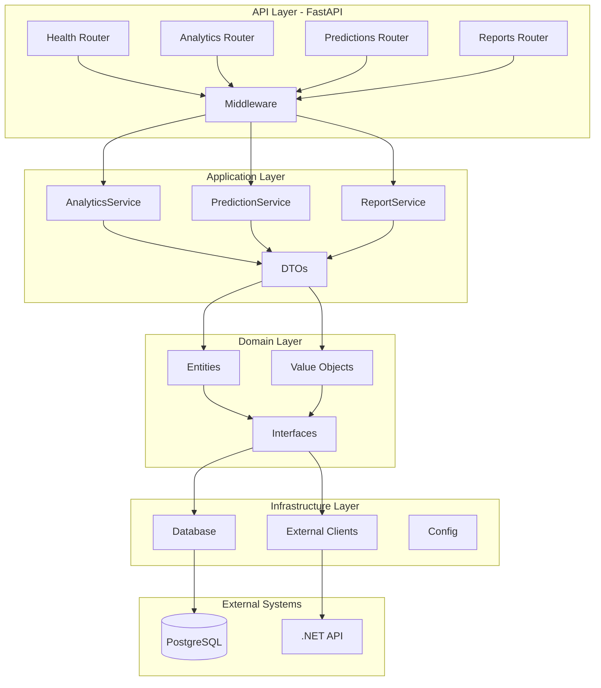

# Python Analytics Service - Documentación Técnica

**Version:** 0.6.0-alpha  
**Bounded Context:** Analytics & Predictions  
**Puerto:** 8000  
**Container:** parhelion-python

---

## 1. Visión General

El Python Analytics Service es un microservicio dedicado al **análisis avanzado de datos logísticos** y **predicciones basadas en ML**. Complementa el API .NET principal con capacidades especializadas de procesamiento de datos.


---

## 2. Los 10 Objetivos del Python Service

| #   | Objetivo                                                          | Versión     | Prioridad |
| --- | ----------------------------------------------------------------- | ----------- | --------- |
| 1   | **Health Monitoring** - Endpoints de estado y conectividad        | v0.6.0      | P0        |
| 2   | **Database Integration** - Conexión async a PostgreSQL compartido | v0.6.0      | P0        |
| 3   | **Service Auth** - Autenticación inter-servicios con .NET         | v0.6.0-beta | P0        |
| 4   | **Shipment Analytics** - Métricas históricas de envíos            | v0.7.x      | P1        |
| 5   | **Fleet Analytics** - KPIs de utilización de flota                | v0.7.x      | P1        |
| 6   | **ETA Prediction** - ML para estimación de tiempos                | v0.8.x      | P2        |
| 7   | **Anomaly Detection** - Alertas de retrasos potenciales           | v0.8.x      | P2        |
| 8   | **Excel Reports** - Generación dinámica con pandas                | v0.9.x      | P2        |
| 9   | **Dashboard Data** - Endpoints para KPIs en tiempo real           | v0.9.x      | P1        |
| 10  | **n8n Integration** - Callbacks y eventos bidireccionales         | v0.9.x      | P1        |

---

## 3. Estructura Actual (v0.6.0-alpha)

```
service-python/
├── pyproject.toml              # Configuración del proyecto
├── requirements.txt            # Dependencias para Docker
├── Dockerfile                  # Multi-stage build
├── README.md                   # Documentación del servicio
├── .env.example                # Template de variables
│
├── src/parhelion_py/
│   ├── __init__.py             # Package metadata
│   ├── main.py                 # FastAPI entry point
│   │
│   ├── domain/                 # DOMAIN LAYER
│   │   ├── entities/           # (vacío - v0.7.x)
│   │   ├── value_objects/      # (vacío - v0.7.x)
│   │   ├── exceptions/         # (vacío - v0.7.x)
│   │   └── interfaces/         # (vacío - v0.7.x)
│   │
│   ├── application/            # APPLICATION LAYER
│   │   ├── dtos/               # (vacío - v0.7.x)
│   │   ├── services/           # (vacío - v0.7.x)
│   │   └── interfaces/         # (vacío - v0.7.x)
│   │
│   ├── infrastructure/         # INFRASTRUCTURE LAYER
│   │   ├── config/
│   │   │   └── settings.py     # Pydantic Settings
│   │   ├── database/
│   │   │   └── connection.py   # SQLAlchemy async
│   │   └── external/           # (vacío - v0.6.0-beta)
│   │
│   └── api/                    # API LAYER
│       ├── routers/
│       │   └── health.py       # /health, /health/db, /health/ready
│       └── middleware/         # (vacío - v0.6.0-beta)
│
└── tests/
    ├── conftest.py             # pytest fixtures
    └── unit/
        └── test_health.py      # 4 tests pasando
```

### Componentes Implementados (v0.6.0-alpha)

| Componente    | Archivo                                 | Estado       |
| ------------- | --------------------------------------- | ------------ |
| FastAPI App   | `main.py`                               | Implementado |
| Settings      | `infrastructure/config/settings.py`     | Implementado |
| DB Connection | `infrastructure/database/connection.py` | Implementado |
| Health Router | `api/routers/health.py`                 | Implementado |
| Unit Tests    | `tests/unit/test_health.py`             | 4/4 pasando  |

---

## 4. Estructura Planeada (v0.7.0-v0.9.6)

```
service-python/src/parhelion_py/
│
├── domain/
│   ├── entities/
│   │   ├── base.py                 # BaseEntity, TenantEntity
│   │   ├── analytics_session.py    # AnalyticsSession
│   │   └── prediction_result.py    # PredictionResult
│   ├── value_objects/
│   │   ├── date_range.py           # DateRange VO
│   │   └── metrics.py              # ShipmentMetrics, FleetMetrics
│   ├── exceptions/
│   │   └── analytics_errors.py     # AnalyticsNotFoundError, etc.
│   └── interfaces/
│       └── repositories.py         # IAnalyticsRepository (Port)
│
├── application/
│   ├── dtos/
│   │   ├── requests.py             # AnalyticsRequest, PredictionRequest
│   │   └── responses.py            # AnalyticsResponse, ETAPrediction
│   ├── services/
│   │   ├── analytics_service.py    # ShipmentAnalytics, FleetAnalytics
│   │   ├── prediction_service.py   # ETAPredictionService
│   │   └── report_service.py       # ExcelReportService
│   └── interfaces/
│       └── external_services.py    # IParhelionApiClient
│
├── infrastructure/
│   ├── database/
│   │   ├── connection.py           # (existente)
│   │   ├── models.py               # SQLAlchemy models
│   │   └── repositories.py         # AnalyticsRepository (Adapter)
│   └── external/
│       └── parhelion_client.py     # Anti-Corruption Layer
│
└── api/
    ├── routers/
    │   ├── health.py               # (existente)
    │   ├── analytics.py            # /api/py/analytics/*
    │   ├── predictions.py          # /api/py/predictions/*
    │   └── reports.py              # /api/py/reports/*
    ├── middleware/
    │   ├── auth.py                 # ServiceApiKey validation
    │   └── tenant.py               # Multi-tenant context
    └── dependencies.py             # FastAPI Depends()
```

---

## 5. Roadmap del Servicio Python (v0.6.0)

El siguiente roadmap aplica exclusivamente al desarrollo del microservicio Python Analytics.
Para el roadmap completo del proyecto (v0.7.0-v1.0.0), consultar [README.md](./README.md#roadmap).


| Release      | Nombre      | Entregables                                                       |
| ------------ | ----------- | ----------------------------------------------------------------- |
| v0.6.0-alpha | Foundation  | Estructura base, health endpoints, conexion DB, 4 tests unitarios |
| v0.6.0-beta  | Integration | Middleware de autenticacion, ParhelionApiClient (ACL), logging    |
| v0.6.0-rc.1  | Validation  | Tests E2E, documentacion final, security review                   |
| v0.6.0       | Release     | CI/CD Python en GitHub Actions, merge a develop                   |

---

## 6. Arquitectura de Capas (Clean Architecture)



### Principios de Diseno

| Principio             | Implementacion                                          |
| --------------------- | ------------------------------------------------------- |
| Dependency Inversion  | Domain define interfaces, Infrastructure las implementa |
| Single Responsibility | Cada servicio maneja un caso de uso especifico          |
| Interface Segregation | Interfaces pequenas y especificas por funcionalidad     |
| Open/Closed           | Nuevos routers sin modificar codigo existente           |

---

## 7. Tecnologías y Dependencias

| Categoría       | Tecnología              | Versión     |
| --------------- | ----------------------- | ----------- |
| **Runtime**     | Python                  | 3.12+       |
| **Framework**   | FastAPI                 | 0.115+      |
| **ASGI Server** | Uvicorn + Gunicorn      | 0.32+ / 23+ |
| **ORM**         | SQLAlchemy              | 2.0+        |
| **DB Driver**   | asyncpg                 | 0.30+       |
| **Validation**  | Pydantic                | 2.10+       |
| **HTTP Client** | httpx                   | 0.28+       |
| **Auth**        | python-jose             | 3.3+        |
| **Testing**     | pytest + pytest-asyncio | 8.3+        |
| **Linting**     | Ruff                    | 0.8+        |
| **Type Check**  | MyPy                    | 1.13+       |

### Dependencias Futuras (v0.8.x+)

| Categoría | Tecnología   | Uso                    |
| --------- | ------------ | ---------------------- |
| **ML**    | scikit-learn | Predicciones           |
| **Data**  | pandas       | DataFrames             |
| **Math**  | numpy        | Operaciones numéricas  |
| **Excel** | openpyxl     | Generación de reportes |

---

## 8. Endpoints Actuales y Planeados

### Implementados (v0.6.0-alpha)

```bash
GET  /health         # Estado del servicio
GET  /health/db      # Conectividad PostgreSQL
GET  /health/ready   # Readiness probe (K8s)
GET  /docs           # Swagger UI (dev only)
```

### Planeados (v0.7.x+)

```bash
# Analytics
GET  /api/py/analytics/shipments          # Métricas de envíos
GET  /api/py/analytics/fleet              # Métricas de flota
GET  /api/py/analytics/drivers/{id}       # Por chofer

# Predictions
POST /api/py/predictions/eta              # Predicción ETA
POST /api/py/predictions/anomalies        # Detección anomalías

# Reports
POST /api/py/reports/export               # Generar Excel
GET  /api/py/reports/{id}/download        # Descargar reporte

# Dashboard
GET  /api/py/dashboard/kpis               # KPIs principales
GET  /api/py/dashboard/realtime           # Métricas tiempo real
```

---

## 9. Variables de Entorno

| Variable               | Requerida | Default                     | Descripción                 |
| ---------------------- | --------- | --------------------------- | --------------------------- |
| `DATABASE_URL`         |           | -                           | PostgreSQL async connection |
| `JWT_SECRET`           |           | -                           | Secret para validar tokens  |
| `INTERNAL_SERVICE_KEY` |           | -                           | Auth inter-servicios        |
| `PARHELION_API_URL`    | No        | `http://parhelion-api:5000` | URL del API .NET            |
| `ENVIRONMENT`          | No        | `development`               | dev/production/testing      |
| `LOG_LEVEL`            | No        | `info`                      | debug/info/warning/error    |
| `WORKERS`              | No        | `4`                         | Gunicorn workers            |

---

## 10. Comunicación Inter-Servicios


---

**Última actualización:** 2025-12-28  
**Próxima milestone:** v0.6.0-beta (Auth + ACL)
