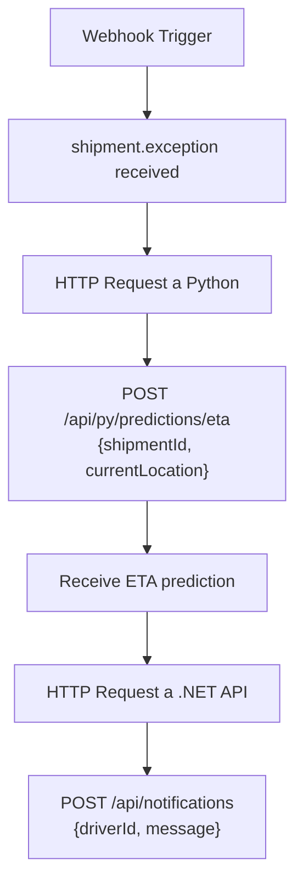

# Parhelion - Webhooks & Event System

**Version:** 1.0 (Integration v0.5.6)
**Scope:** Event-Driven Architecture / Automation Integrations

---

## 1. Visión General

El sistema de Webhooks de Parhelion permite la integración en tiempo real con sistemas externos (como n8n, Zapier) mediante un modelo **Push**. Cuando ocurre un evento de dominio significativo (ej. `shipment.exception`), el backend envía automáticamente un payload JSON a la URL configurada.

### Características Clave

- **Modelo:** Fire-and-Forget (con soporte para Callbacks síncronos).
- **Seguridad:** Autenticación bidireccional mediante `CallbackToken` (JWT).
- **Payload:** Estructurado en un "Envelope" estándar.

---

## 2. Seguridad & Autenticación

Para evitar compartir `API Keys` de larga duración con scripts de automatización externos, Parhelion implementa un sistema de **Tokens Efímeros (Callback Tokens)**.

### 2.1 El Callback Token

Cada webhook enviado incluye un `callbackToken` en el JSON. Este es un **JWT (JSON Web Token)** firmado por el backend con las siguientes propiedades:

- **Expiración:** 15 minutos desde la emisión.
- **Alcance:** Permite realizar llamadas al API en nombre del Tenant que originó el evento.
- **Audiencia:** `n8n-callback`.

### 2.2 Consumo (Ida y Vuelta)

El sistema externo (ej. n8n) debe usar este token para autenticar cualquier llamada de regreso (`Callback`) que necesite hacer para enriquecer datos o ejecutar acciones.

**Header Requerido en llamadas al API:**

```http
Authorization: Bearer <callbackToken>
```

> **Importante:** No es necesario configurar credenciales estáticas (API Key) en el consumidor del webhook. El token viene "fresco" con cada evento.

---

## 3. Estructura del Mensaje (Envelope)

Todos los eventos siguen esta estructura estandarizada:

```json
{
  "eventType": "shipment.exception",
  "timestamp": "2025-12-23T01:57:30Z",
  "correlationId": "uuid-v4",
  "callbackToken": "eyJhbGciOiJIUzI1Ni...",
  "payload": {
    // Datos específicos del evento
  },
  "webhookUrl": "http://destino/webhook",
  "executionMode": "production"
}
```

---

## 4. Catálogo de Eventos

### 4.1 shipment.exception

Se dispara cuando un envío cambia su estado a `Exception`. Utilizado para activar protocolos de gestión de crisis.

**Payload Schema:**
| Campo | Tipo | Descripción |
|-------|------|-------------|
| `shipmentId` | UUID | Identificador único del envío. |
| `trackingNumber` | String | Código de rastreo (ej. TRX-2025-001). |
| `tenantId` | UUID | Tenant propietario del envío. |
| `latitude` | Decimal | Latitud GPS del camión al momento del evento. |
| `longitude` | Decimal | Longitud GPS del camión al momento del evento. |
| `currentLocationCode` | String | Código del Hub actual (ej. MTY-HUB). |

### 4.2 shipment.status_changed

Se dispara ante cualquier cambio de estado (Created -> InTransit -> Delivered).

---

## 5. Guía de Integración con n8n

Para consumir estos webhooks correctamente en n8n y asegurar la lectura de datos anidados y autenticación:

### 5.1 Acceso a Variables

n8n estructura el input entrante bajo un objeto `body`. Las expresiones deben respetar esta jerarquía:

- **Token de Acceso:** `$json.body.callbackToken`
- **Datos del Payload:** `$json.body.payload.<campo>` (ej. `$json.body.payload.latitude`)

### 5.2 Configuración de Nodos HTTP Request (Callback)

Si el flujo de n8n necesita consultar información adicional a Parhelion (ej. "Get Drivers Nearby"):

1. **Authentication:** `None` (Desactivar auth predeterminada).
2. **Header Parameter:**
   - **Name:** `Authorization`
   - **Value:** `Bearer {{ $json.body.callbackToken }}`

Esto asegura que el flujo utilice siempre el token válido de la sesión actual.

---

## 6. Integración con Python Analytics Service (v0.6.0+)

El microservicio Python participa en el sistema de eventos para análisis y predicciones.

### 6.1 Eventos hacia Python

| Evento               | Trigger                  | Payload                                       |
| -------------------- | ------------------------ | --------------------------------------------- |
| `analytics.request`  | Admin solicita análisis  | `{ tenantId, dateRange, type, filters }`      |
| `prediction.request` | n8n necesita ETA         | `{ shipmentId, currentLocation, urgency }`    |
| `report.generate`    | Usuario solicita reporte | `{ tenantId, reportType, dateRange, format }` |

### 6.2 Callbacks desde Python

| Callback              | Destino  | Method | Payload                                    |
| --------------------- | -------- | ------ | ------------------------------------------ |
| `analytics.completed` | .NET API | POST   | `{ sessionId, results, executionTime }`    |
| `prediction.ready`    | n8n      | POST   | `{ shipmentId, eta, confidence, factors }` |
| `report.ready`        | .NET API | POST   | `{ reportId, downloadUrl, expiresAt }`     |

### 6.3 Autenticación Python ↔ n8n

Cuando n8n necesita llamar al Python Service:

1. **URL Base:** `http://parhelion-python:8000/api/py`
2. **Header:** `Authorization: Bearer {{ $json.body.callbackToken }}`
3. **Scope requerido:** `analytics:read` o `predictions:execute`

### 6.4 Ejemplo: Workflow n8n con Python



---

## 7. Variables de Entorno Requeridas (v0.6.0+)

| Variable               | Servicio     | Descripción                                                       |
| ---------------------- | ------------ | ----------------------------------------------------------------- |
| `INTERNAL_SERVICE_KEY` | .NET, Python | Clave compartida para auth inter-servicios                        |
| `PYTHON_SERVICE_URL`   | .NET         | URL del servicio Python (default: `http://parhelion-python:8000`) |
| `PARHELION_API_URL`    | Python       | URL del API .NET (default: `http://parhelion-api:5000`)           |
| `JWT_SECRET`           | Todos        | Secreto compartido para validar tokens                            |
